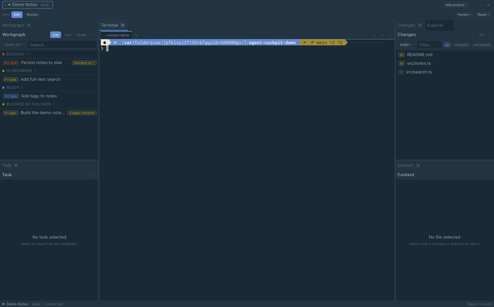
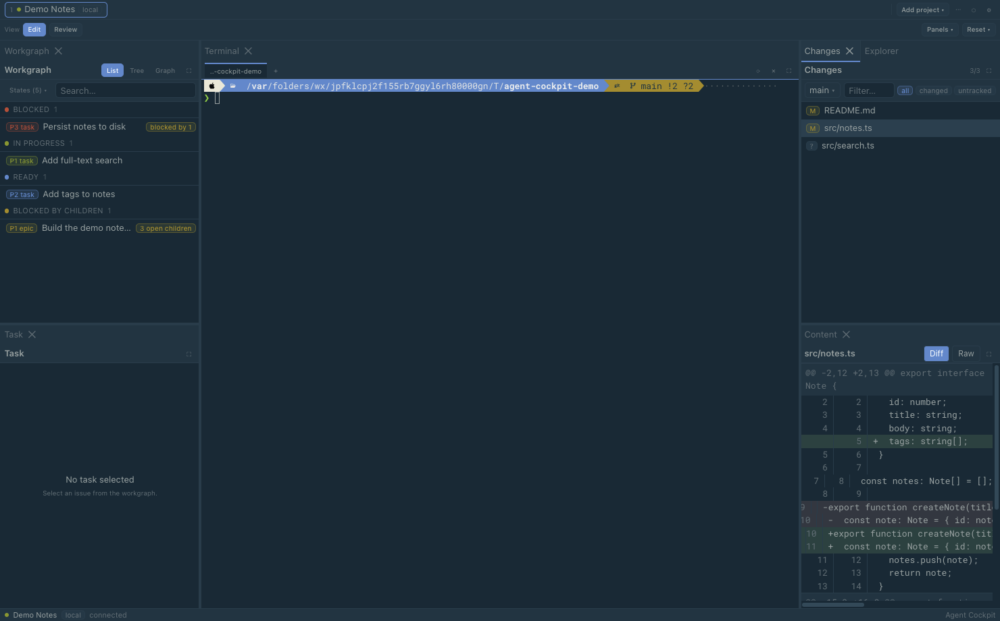
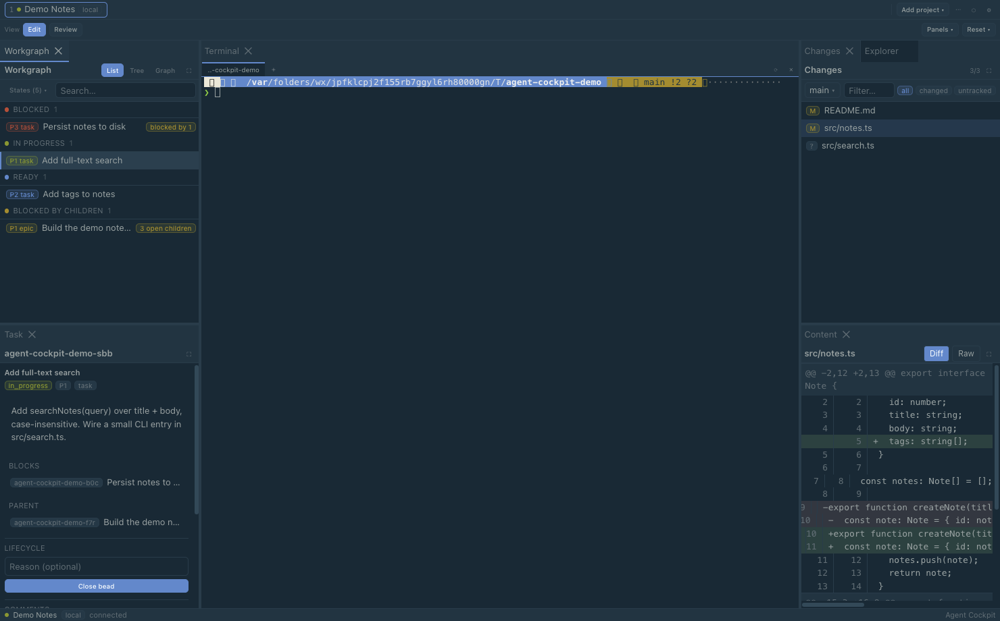

# Agent Cockpit

> **Heads-up:** This is a highly opinionated, personal tool — built specifically
> around the way I work, not as a general-purpose product. Its defaults, scope, and
> workflow assumptions reflect my own setup; it may not fit yours, and that's by
> design.

A lightweight Electron desktop **cockpit for driving a CLI coding agent** against
a single active repository — local or remote over SSH — while you watch the work
through first-class review surfaces.

The agent runs in an embedded terminal and performs every repository write. The
surrounding review surfaces — workgraph, change list, diff/preview content viewer,
and notes — are read-only projections sourced through a transport-agnostic provider
seam. The exception is **task detail**, which can also act on the beads issue graph
(close/reopen a task, add comments, create child tasks).

## Overview

- **One active project at a time**, shown in a top tab strip; background projects
  stay fully live, so switching back is instant.
- **Two operating modes** behind one workspace-provider abstraction: **Local**
  (filesystem) and **Remote** (SSH, via an auto-provisioned static Go helper that
  serves a narrow read-only RPC — no bulk transfer or filesystem mount).
- **First-class terminal** (`xterm.js`) running an interactive agent harness
  inside `tmux` on a dedicated `agent-cockpit` socket, so sessions persist across
  restarts. Two selectable backends: session-per-tab and tmux control mode
  (`-CC`).
- **Review surfaces:** workgraph, changes list, a content viewer (unified diff,
  rendered Markdown with changed-block callouts, Mermaid, image compare), and
  notes are read-only; **task detail** can also act on the beads graph
  (close/reopen, comment, create child tasks).
- **Dockview workspace** with curated Edit and Review layout presets and
  per-project layout persistence.

See [docs/REQUIREMENTS.md](docs/REQUIREMENTS.md) and
[docs/ARCHITECTURE.md](docs/ARCHITECTURE.md) for the full picture.

## Screenshots

The workspace — agent terminal in the center, the beads workgraph on the left,
and the changes list + content viewer on the right:



The content viewer rendering a unified diff of a changed file:



Task detail — beads issue state with inline lifecycle actions (the one app-side
write surface; everything else is read-only):



> Screenshots use a throwaway demo project and are regenerated with
> `npm run screenshots` (see [scripts/screenshots/](scripts/screenshots/)).

## Installation

**Prerequisites:** Node.js ≥ 20 and a Go toolchain (≥ 1.21) on macOS or Linux.
The native modules (`better-sqlite3`, `node-pty`, `ssh2`) are rebuilt against
Electron's ABI automatically, and the remote-helper binaries are cross-compiled
from source by the `predev`/`prebuild` npm hooks (they are not checked in). Go is
a **build-time** requirement only — users of a packaged app do not need it.

Run from source (dev mode, hot-reload, nothing installed system-wide):

```sh
bin/run        # installs deps if needed, then `npm run dev`
# or
npm run dev
```

Build standalone packages into `release/`:

```sh
bin/package --mac     # macOS .dmg + .zip (arm64)
bin/package --linux   # Linux AppImage
bin/package --dir     # unpacked app only (fast)
```

See [docs/BUILD.md](docs/BUILD.md) for details.

## Usage

1. Launch the app (`npm run dev`, or a packaged build).
2. Add a project — a **Local** path or a **Remote** SSH target — from the project
   tab strip.
3. The center terminal attaches to a persistent `tmux` session; run your CLI
   coding agent there. The agent performs all repository writes.
4. Watch the work through the read-only panels (workgraph, changes, content
   viewer). Switch projects with the tab strip or `Cmd/Ctrl+1..9`; flip between
   the Edit and Review layout presets as needed.

Common scripts:

```sh
npm run dev          # run in dev mode
npm run build        # compile
npm test             # run the test suite (vitest)
npm run lint         # eslint
npm run typecheck    # tsc
```

## Known Issues

- **Occasional terminal text glitches:** the terminal renderer can intermittently
  garble glyphs or leave stale cells. Refreshing the panel (the tab's refresh
  button) or resizing the window repaints it cleanly. An experimental alternative
  renderer (`wterm`, selectable in Preferences) aims to resolve this but is not yet
  stable.
- **Tight split widths:** dragging a control-mode split until one pane is roughly
  prompt-wide can surface zsh's `%` missing-newline marker on the next prompt,
  because tmux, xterm's fit addon, and the flex layout round cell counts
  independently. Resizing the panel or window clears it.
- **Platform support:** macOS and Linux only; Windows is not supported.
- **Cross-compiling:** native modules are rebuilt for the host, so build each
  platform's artifacts on that platform.

## License

Licensed under the [Apache License 2.0](LICENSE).
