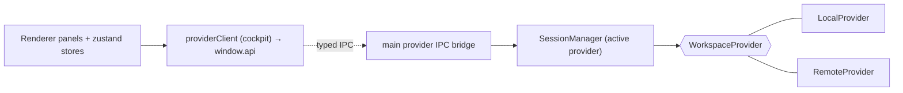
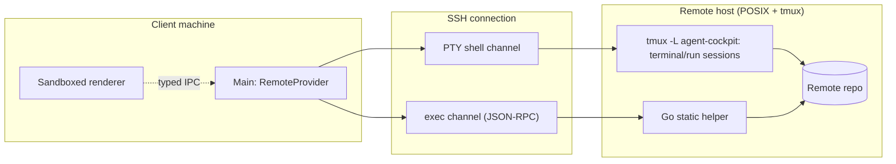
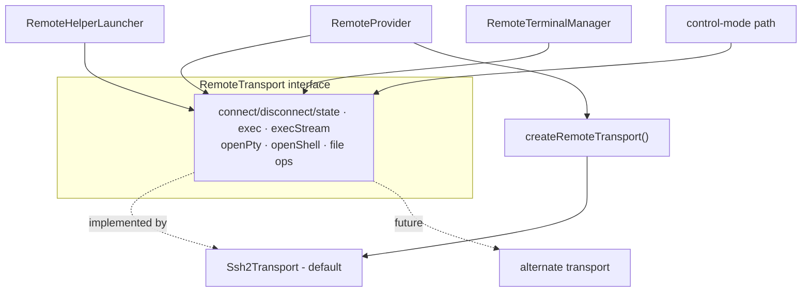
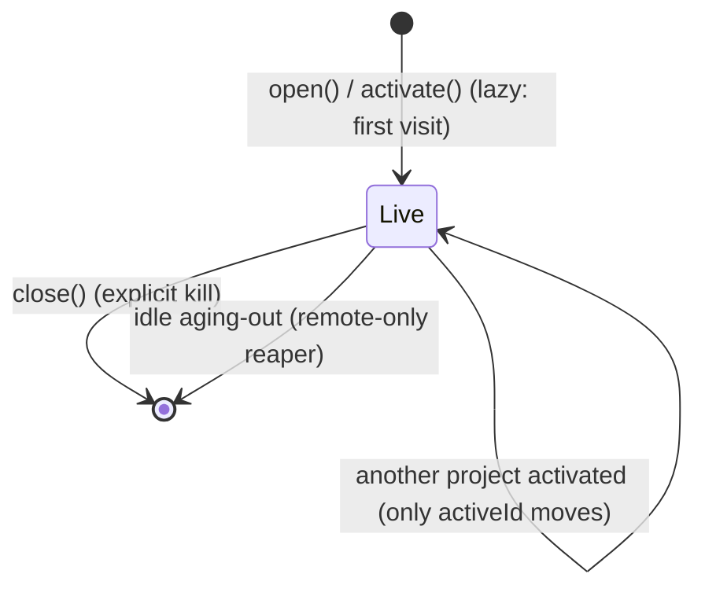
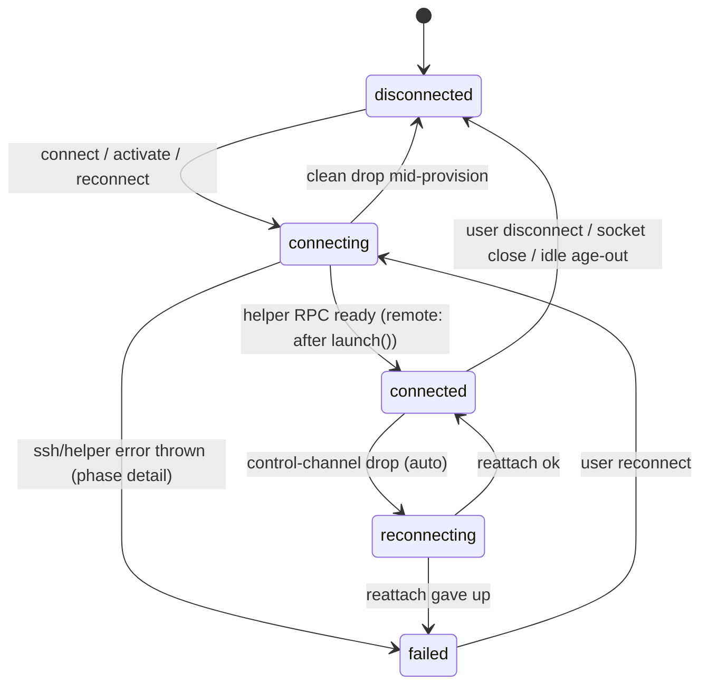

<!-- AI NOTE: doc_standard=engineering-docs-standards; version=2; doc_kind=architecture -->

# Architecture

## System Overview and Boundaries

The Agent Cockpit is an Electron application: a sandboxed React renderer, a
narrow preload bridge, and a capability-bearing main process. It drives a CLI
coding agent against one active repository — local or remote over SSH — and
presents review surfaces around it — read-only except beads edits via task
detail. The organizing principle is the
**`WorkspaceProvider` seam**: the renderer addresses the *active provider*
through typed IPC and never knows whether the project is local or remote.

The durable architectural boundaries are:

- **Renderer sandbox + narrow preload.** The renderer runs with
  `contextIsolation: true`, `nodeIntegration: false`, `sandbox: true`. It has no
  Node or filesystem access; it sees only typed payloads via `window.api`. The
  preload forwards typed IPC and carries no business logic.
- **App writes are narrow.** The app writes its app-local SQLite store under
  `userData/`, and — as the single exception — beads issue state through the `br`
  CLI (never the beads SQLite DB or working tree directly; see NFR-2). It does not
  otherwise mutate the repository or git state.
- **Agent-terminal as the primary write path.** All working-tree and git
  mutation happens through the CLI agent the user runs in the embedded terminal
  (or the Run panel); the lone app-side exception is beads issue state via `br`. Both are backed by `tmux` on a dedicated `agent-cockpit` socket so
  sessions persist across restarts and stay isolated from the user's own tmux.
  Two backends coexist behind the `WorkspaceProvider` seam and are selected by
  the `terminalBackend` setting in [src/shared/settings.ts](../src/shared/settings.ts):
  the default **session-per-tab** model namespaces sessions as
  `agent-cockpit-terminal-<projectId>-<key>` (terminal tabs) and a single
  `agent-cockpit-run-<projectId>` (Run panel); the **control-mode (`-CC`)**
  model drives one per-project session (`agent-cockpit-<projectId>`) where
  tmux is the authority for windows and panes. Switching backends is a
  clean-slate operation that kills every cockpit-socket tmux session. Every
  other surface (changes, content viewer, notes, sessions) is a read-only
  projection; beads navigation is read-only too, but **task detail** writes
  issue state via the `br` CLI (see NFR-2).
- **Untrusted repository content.** Repository Markdown/Mermaid and file bytes
  are untrusted: Markdown runs through one whole-document `unified`
  (`remark-parse` → `remark-gfm` → `remark-rehype` → `rehype-highlight` →
  local safe-link/image transform → `rehype-stringify`) pass and is sanitized
  via DOMPurify, Mermaid renders in a sandboxed iframe with no same-origin
  access, external anchors are routed via `setWindowOpenHandler`
  → `shell.openExternal`, and large/binary files degrade to notices.
  `rehype-highlight` (with the bundled base16 Solarized hljs theme) is the
  only Markdown-pipeline dependency added beyond the `unified` stack.

## Major Components and Responsibilities

| Component | Process | Responsibility |
|-----------|---------|----------------|
| `WorkspaceProvider` | shared type | The transport seam: lifecycle, terminal, git, fs, beads, watch. Every live session stays fully active (no suspend/resume). |
| `LocalProvider` | main | Local backing: simple-git/fs/beads reads, chokidar watch, node-pty terminal, local tmux control-mode (`-CC`) session manager. |
| `RemoteProvider` | main | SSH backing: pluggable `RemoteTransport` (ssh2 default) behind a factory, Go-helper RPC reads, tmux-over-ssh terminal, remote tmux control-mode session manager with reconnect/resync. |
| `RemoteTransport` / `Ssh2Transport` | main | Provider transport boundary: the only seam that touches `ssh2`; `Ssh2Transport` is the default implementation (host-key verified). |
| `sessionReaper` | main | Periodic remote-only idle aging-out: the first main-process timer; ends idle remote sessions via the shared `SessionManager.close` teardown. |
| Shared tmux protocol (`src/shared/tmux/`) | shared | Pure parser/codec/layout/command builders for tmux control mode — `%begin`/`%end`/`%error` reply correlation, `%output` decode, window-layout-string parsing, hex `send-keys` encoding. Consumed by both host managers. |
| `ProviderRegistry` | main | Builds a provider from `{ projectId, spec }`. |
| `SessionManager` | main | At most one provider per project; one `activeId`. All live sessions stay fully active (background-live); owns the per-session watch lifecycle and the idle-activity tracker. |
| Provider IPC bridge | main | Typed handlers routing renderer calls to the active provider + SQLite store; forwards push events; validates inputs. |
| SQLite store | main | App-local persistence (projects + order + run command, layouts, notes, since-seen, settings). |
| tmux session inventory | main | Lists/kills sessions on the `agent-cockpit` socket for the Sessions panel. |
| Remote helper | remote host | Go static binary serving read RPC + fs-watch over the SSH exec channel. |
| Renderer shell/workspace/panels | renderer | App shell, top project tab strip, Dockview workspace, xterm terminal + Run panel, read-only review panels, zustand stores. |

## Runtime Topology and Flows

### Provider Seam (central boundary)



Panels depend only on the `WorkspaceProvider` contract; `LocalProvider` and
`RemoteProvider` are interchangeable implementations selected per project. This
replaces v1's direct per-feature IPC services as the organizing principle.

### Three-Tier Remote Topology



The interactive agent runs inside `tmux` on the PTY shell channel (so it
survives disconnect/restart); the helper serves read/diff/watch on a separate
exec channel so RPC traffic never pollutes terminal scrollback. The host does
the watch/diff/read work and streams results — the client never mounts or
mirrors the tree.

### Remote Transport Provider Boundary

`RemoteProvider` talks to the host through a **mechanism-agnostic
`RemoteTransport` interface** (`electron/main/providers/remote/transportTypes.ts`)
rather than a raw ssh2 client. The wire mechanism is swappable behind a factory;
ssh2 is the default and currently only implementation.



- **`ssh2` is encapsulated in exactly one file.** `Ssh2Transport`
  (`transport.ts`) is the only module that imports `ssh2`/`@types/ssh2`; an ESLint
  `no-restricted-imports` rule enforces this. The old `transport.client()` raw-
  client leak is removed — `RemoteHelperLauncher`, `RemoteTerminalManager`, and
  the control/kill paths depend only on the interface.
- **Operation surface:** lifecycle/state (`connect`/`disconnect`/`state`/
  `onStateChange`), one-shot `exec` (lenient: returns `{stdout, stderr, code}`,
  never rejects on non-zero), long-lived `execStream` duplex for the helper RPC
  (the existing `RpcStream` shape, so `rpcClient.ts` is untouched), `openPty`
  (control-mode) and `openShell` (terminals) PTY channels, and a single-SFTP-session
  file-provisioning surface (`uploadExecutable`/`mkdirp`/`exists`).
- **Raw-byte channel contract (typed):** `PtyChannel`/`DuplexChannel` `onData` is
  typed `(b: Uint8Array) => void` and delivers wire bytes undecoded, making the
  control-mode raw-byte invariant a typed contract end to end (see the byte
  pipeline in the Terminal Lifecycle section).
- **`~/.ssh/config` alias resolution:** because ssh2 does not read
  `~/.ssh/config`, `Ssh2Transport` resolves a `Host`-alias spec through an in-repo
  resolver (`sshConfigResolve.ts`), applying the alias's `HostName`/`Port`/`User`/
  `IdentityFile` (spec-explicit values win, then config, then default) so
  alias-based projects connect instead of failing `ENOTFOUND`. The host-key check
  below verifies against the **resolved** host. ProxyJump, bastions, and the wider
  OpenSSH config surface (`Match`/`Include`) remain deferred to a future
  native-ssh transport; this resolver stays minimal.
- **Host-key verification:** `Ssh2Transport` verifies the host key against the
  user's `known_hosts` (ssh2 `hostVerifier`), closing the prior silent-accept MITM
  gap; a mismatch surfaces as a typed `RemoteTransportError` with `phase:
  'hostkey'`. `hostKeyPolicy` is part of the `connect` options contract so any
  future transport satisfies the same verification. Auth (privateKey from
  `identityPath`, else SSH agent) is a transport responsibility behind `connect`.
- **Selection seam:** `createRemoteTransport()` (`transportFactory.ts`) resolves
  the implementation; with only ssh2 present it returns `new Ssh2Transport()`.
  Adding an alternate is one factory case + one new file — no consumer change.
  Connection status remains owned solely by `ConnectionMachine`; the transport
  only emits transport-level state.

### Per-Session Liveness Model



**The session is the liveness unit, not the panel.** `SessionManager` keeps at
most one provider per project and a single `activeId`, but **every live session
stays fully active** — there is no warm/hot distinction and no `suspend()`/
`resume()`. A backgrounded session keeps its terminal, its watch subscription,
and its helper RPC live, so its per-session data (Changes, Workgraph) stays
continuously current regardless of which project is focused. `activate()` only
sets/persists `activeId` (the default target for omitted-`projectId` reads and the
slice panels render); it never pauses another session.

Liveness is **lazy**: a project becomes live when first activated, not
pre-connected on boot; a never-visited project is not connected. Per-session data
is **resident in memory until the session ends**, and a session ends only by
**explicit kill** (`SessionManager.close`) or by **idle aging-out** (the remote-only
reaper below) — losing focus never ends a session. This is the concurrency and
resource model: cost grows with the number of *live* sessions (one watch
subscription each, no per-session polling), bounded by explicit kill plus aging-out.

Provider reads are addressable by `projectId` (`providerFor(projectId?)` —
explicit id → that session, omitted → active), so any live session's data can be
loaded/refreshed regardless of which project is active; "active" is the default,
not the only, read target. The renderer holds one `byProject[projectId]` slice
per live session in `changesStore`/`beadsStore`, and panels are pure derivations
of `(activeId, perSessionStatus, byProject slice)` (see the Connection State
Machine invariant). A single renderer `panelDataSync` orchestrator drives
load/refresh/clear off per-session connection status + `projectId`-routed watch
events.

### Session Idle Aging-Out (resource bound)

`sessionReaper` (`electron/main/providers/sessionReaper.ts`) bounds the live set
by automatically ending sessions that have gone unused past a configurable
threshold — the same mental model as reaping idle terminal windows. It is the
**first periodic main-process timer** and establishes the canonical pattern for
any future periodic main work: a single `setInterval` at a coarse cadence (~60 s,
independent of the threshold), an **injected clock** for testability, and
**clear-on-quit** (`will-quit` stops the reaper before `closeAll`, so no leaked
interval and no tick during quit).

- **Remote-only in v1:** only `kind === 'remote'` sessions age out (local sessions
  free no SSH/RPC and are exempt); `provider.kind` makes it uniform later.
- **Non-destructive:** aging-out calls the shared `SessionManager.close(projectId)`
  teardown — the same path as explicit kill (eviction listeners → IPC tmux-cache
  disposal → per-session watch stop + renderer slice evict). It detaches the
  control client but never `kill-session`s, so server-side tmux and any running
  agent survive; the **project stays listed** and re-selecting it reconnects and
  re-seeds via the normal `activate()`/`open()` path.
- **Candidate gating:** the active/focused session is never reaped (re-checked
  immediately before `close()` to close the focus race), nor is a session that is
  `connecting`/`reconnecting`/not `connected`. Status is read from the
  `ConnectionMachine` truth (`SessionManager.statusOf`), never a renderer enum.
- **Activity sources:** a runtime `activityAt` map (owned by `SessionManager`,
  not persisted) is touched on focus, on `open()`, and on background control-mode
  `%output` (so a backgrounded agent's output keeps its session alive);
  structural notifications and watch events do not count.
- **Configuration:** `sessionIdleTimeoutMin` in `AppSettings` (default 20; `0`
  disables), read each tick so changes apply without restart. An aged-out session
  sets a distinct `ConnectionStatus.detail` cue so it is not mistaken for a
  network drop. Aging drives status through the existing `ConnectionMachine`
  teardown, not a parallel state.

### Connection State Machine (invariant)

Connection state has **one authoritative owner in main**: a per-project
`ConnectionMachine`
([electron/main/providers/connectionMachine.ts](../electron/main/providers/connectionMachine.ts)).
All state changes flow through it; there is no ad-hoc `setStatus` from scattered
call sites and no parallel "connection-ish" truth that can disagree. This is an
enforceable invariant: reintroducing a second connection state (e.g. a renderer
`ControlSessionStatus` enum) reintroduces the mishmash class of bugs
(disconnect not reflected, terminal not recovering, panels showing stale data).



- **Guarded transitions.** Only the edges above are legal; illegal transitions
  are rejected (warn-logged, no-op), never thrown. Concurrent
  `connecting`/`reconnecting` requests coalesce to the in-flight transition so a
  rapid toggle never builds duplicate providers/channels.
- **Remote `connected` means helper-RPC-ready.** For remote, `toConnected()`
  fires **after** `RemoteHelperLauncher.launch()` resolves (RPC proven), not on
  raw socket-up — socket-up maps to `connecting` — so a read issued the moment a
  project reports `connected` never fails "helper unavailable". The
  `connecting → disconnected` edge is legal so a drop during provisioning resolves
  cleanly instead of stranding the machine; `connecting → failed` is the
  thrown-error edge. Local projects short-circuit to `connected` (already "ready")
  and never flow remote transitions.
- **Main is authoritative; renderer derives.** Providers/transport feed events
  into the machine; `SessionManager` forwards the machine's `ConnectionStatus`
  via a single `evt:status`. The renderer's status indicator, terminal control
  session, and the Changes/Explorer/Workgraph panels are **pure derivations** of
  that status (`sessionStore` + `isConnected`/`isDisconnected` selectors); the
  Changes/Workgraph panels additionally derive their per-project `byProject` slice
  off per-session status + watch events (never `activeId` alone). No parallel
  connection truth — and no `suspend()`/`resume()` — may be reintroduced.
- **Status is wired before connect.** `SessionManager` subscribes to provider
  status in `open()` *before* calling `connect()`, so the first
  `connecting → connected` transition is never dropped (the wire-after-connect
  ordering left the UI stuck on the `disconnected` fallback).
- **Disconnect = teardown, reconnect = rebuild.** On `disconnected`, the terminal
  control session is released, the per-project pane registry entries are disposed
  (`disposeProject` — so a reconnect re-binds output sinks rather than reusing a
  cached entry with no sink), the IPC control/terminal caches for the project are
  evicted (via `SessionManager.onEviction`, so a new provider wires fresh
  notification subscriptions), and panels clear to an explicit "Disconnected"
  state. On reconnect the provider is rebuilt fresh (re-running remote helper
  provisioning), the terminal re-acquires and re-focuses, and panels reload.
  Freeze-and-reattach (preserving scrollback across a disconnect) is a deferred
  future option, not the v1 behavior.

### Control-channel reattach & re-init (epoch signal, invariant)

A remote tmux control channel (`tmux -CC`) reconnects **independently of the SSH
transport and the `ConnectionMachine`**. When the channel drops for a transient
reason — network/keepalive blip, laptop sleep/wake, or the responsiveness
watchdog failing the link — `RemoteTmuxControlManager.scheduleReattach`
([electron/main/providers/remote/tmuxControl.ts](../electron/main/providers/remote/tmuxControl.ts))
opens a **fresh** channel (with a fresh parser) and re-attaches to the surviving
remote tmux session. The `ConnectionMachine` stays `connected` the entire time,
so **no status transition fires**. Re-init therefore cannot be driven off
connection status; it is driven off a **channel-attach epoch**.

- **Epoch signal.** Each control manager (local and remote) keeps a monotonic
  `epoch` bumped on every successful attach — the first open **and** every silent
  reattach — and emits a synthetic `{ type: 'attached', epoch }` notification
  through the same `onNotification` → `evt:tmux` seam as real tmux notifications.
  This unifies first-connect and reattach: both mean "a fresh channel is live".
- **Renderer re-init keyed on epoch, not status.** `controlSession`
  ([src/renderer/tmux/controlSession.ts](../src/renderer/tmux/controlSession.ts))
  keeps a per-project `channelEpoch` (latest announced) and `initializedEpoch`
  (latest re-initialized). When they differ for the active project it runs
  `reinitProject`: an **authoritative** `syncFromTmux` (folds `list-windows` and
  **prunes** windows absent from it — a window closed during the drop replays no
  `%window-close`), reserved-window reconcile, and `restoreActiveWindow` (adopts
  tmux's session-active window via a synthetic `session-window-changed` so a
  reconnect focuses the **last-worked** window, not the first tab). A single-flight
  with a pending re-drain catches an epoch that lands mid-sync without spinning on
  a bare empty-list attach race. The boolean "initialized once" guard this
  replaced was the root cause of the stale-window-list / stale-display class:
  it skipped re-init entirely on a reattach.
- **Display restore.** After the window sync, `controlSession` fires
  `subscribeReinit`; `ControlTerminalPanel` mirrors the toolbar **hard refresh**
  for the active project — `hardRecoverTab` (capture-pane re-seed of normal-screen
  panes, so content missed during the drop is recovered; alt-screen TUIs are gated
  to a repaint only, no runaway scroll) plus a `nudgeClientSize` resize round-trip
  that makes tmux re-emit `%output` and SIGWINCH the pane apps.
- **Per-project teardown.** `resetControlSession(projectId)` clears only that
  project's lifecycle and **keeps** the shared `evt:tmux` subscription and that
  project's `channelEpoch`, so disconnecting one project never clobbers another
  live one, and a re-acquire that causes no fresh attach (a renderer backend
  switch with tmux still open) still re-inits because `initializedEpoch` is now
  behind the kept `channelEpoch`.
- **Honest status (observability).** The manager exposes
  `onReconnecting`/`onReattached`/`onReattachExhausted` hooks that the
  `RemoteProvider` wires to `machine.toReconnecting()`/`toConnected()`/`toFailed()`
  so a flap shows a `reconnecting` dot. This is observability only — correctness
  of re-init depends on the epoch, never on the status transition, so wiring
  `reconnecting` cannot reintroduce the status-inferred re-init bug.

**Regression check:** on a remote project, force a `-CC` channel flap (kill the
SSH transport, or sleep/wake the host) so it auto-reattaches with **no** user
action: the window list and every pane display must be correct without a manual
refresh or window switch, and the tab focused must be the window the user was
last working in (not the first).

### Terminal Lifecycle Decoupling (invariant)

Terminal/xterm lifecycle is **decoupled from React mount and from project
switching**. This is an enforceable invariant, not a preference: violating it
reintroduces the project-switch rebuild class of bugs (blank-until-keystroke,
empty-state flash, keyboard lag, and cross-project output bleed).

- **xterm instances are owned by module-level registries keyed by project
  identity**, never by the React component tree:
  - session-per-tab terminals →
    [`terminalRegistry`](../src/renderer/terminal/terminalRegistry.ts), keyed by
    `(projectId, kind, key)`;
  - control-mode (`-CC`) panes →
    [`controlPaneRegistry`](../src/renderer/tmux/controlPaneRegistry.ts), keyed by
    `(projectId, paneId)`.
  Each xterm renders into a detached container that is **reparented** into the
  current panel host; React views attach/detach, they do not create/dispose.
- **Per-project tmux view state is namespaced by `projectId`**
  ([`tmuxStore`](../src/renderer/tmux/tmuxStore.ts): `byProject` + a single
  `activeProjectId`). The tmux pane id (`%0`) repeats across each project's
  session, so output sinks are keyed by `(projectId, paneId)`.
- **Switching projects only moves the active selection** (`setActiveProject`).
  It MUST NOT dispose/recreate xterm instances, reset a project's view slice, or
  re-seed terminals. A single always-on control-mode subscription routes every
  notification to its project's slice, so all visited projects stay live and a
  return is instant.
- **Disposal is explicit or idle**: only an explicit close (tab/pane/window) or
  the registry idle reaper (detached + untouched past the threshold) disposes an
  instance; the underlying tmux session survives so a later return reattaches.
- **Backend selection** lives in the `terminalBackend` setting; the two
  registries are siblings, never active at the same time. Switching backends
  ([src/renderer/terminal/backendSwitch.ts](../src/renderer/terminal/backendSwitch.ts))
  kills every cockpit-socket session, disposes both registries, and remounts
  the terminal panel so the chosen backend re-initializes from a clean slate.
- **Control-mode raw-byte invariant.** The `-CC` data pipeline carries raw
  bytes end-to-end: node-pty is opened with `encoding: null`, the shared
  parser is fed `Uint8Array`, and the renderer writes bytes directly into
  xterm; the `capture-pane` seed re-encodes the parser's latin1-mapped reply
  string back to bytes before writing. This matters because tmux's `%output`
  only octal-escapes control bytes (`< 0x20`); every byte `> 0x7E` — the UTF-8
  sequences for non-ASCII glyphs — is emitted verbatim, so any intermediate
  UTF-8 decode truncates multi-byte glyphs to their low byte and corrupts every
  non-ASCII glyph in a TUI (powerline, box-drawing, emoji). Regression check:
  open a control-mode terminal and run a glyph-rich TUI (`vim`, `htop`,
  `claude`); garbled glyphs mean the invariant is broken.

## Major Data and State Model

- **App-local SQLite** under `userData/` (WAL), schema via ordered idempotent
  migrations tracked in `migrations(version)`. Cockpit tables:
  `agent_cockpit_projects` (registry, full `ConnectionSpec` as JSON, plus
  `sort_order` for the user-controlled tab order and `run_command` for the Run
  panel), `agent_cockpit_active_project` (single-row active pointer), and
  `agent_cockpit_notes` (review notes by project/worktree/file/hunk/block/bead
  target), plus `layouts` (global / `project:<id>`) and `settings`. Legacy v1
  tables (`projects`, `review_state`, `notes`, `review_passes`, `since_seen`)
  remain in the migration history but are not part of the cockpit schema. No
  migration ever touches a repository or beads database. See
  [docs/DESIGN.md](DESIGN.md) for the full schema.
- **Renderer state** is zustand, consumed via selectors and keyed by the active
  project so background-project changes do not re-render the active view.
  External IPC/watch results are pushed into stores from outside React.
  Connection state specifically is a **derived** mirror (`sessionStore`, fed by
  `evt:status` from the main `ConnectionMachine`); the renderer holds no
  independent connection truth (see the Connection State Machine invariant).

### Workgraph Relationship & State Model (beads_rust) (invariant)

#### Summary
The workgraph normalizes beads issues into `BeadsIssue[]` + `BeadsDep[]` and
derives every rendered state from one pure module
([src/renderer/beads/graphSelectors.ts](../src/renderer/beads/graphSelectors.ts)).
List, Tree, Graph, and TaskDetail are pure derivations of it.

#### Details
- **Dependency direction (authoritative).** A normalized edge is
  `BeadsDep { from = issue_id, to = depends_on_id, type }`. beads_rust stores a
  dependency as *`issue_id` depends on `depends_on_id`*, so for a `blocks` edge
  **`to` blocks `from`** (`from` is the blocked/dependent node). An issue is
  dep-blocked iff it is the `from` of a `blocks` edge whose `to` is non-terminal.
  `parent-child` edges are `{from = child, to = parent}` — structural hierarchy,
  not a work blocker by themselves. This direction is the single authoritative
  reading; an earlier inverted reading marked the wrong side blocked.
- **Terminal equivalence.** `isTerminal(status)` treats `closed`, `tombstone`,
  and `deleted` identically as done (tombstones are also filtered at the read
  layer in `electron/main/beads/normalize.ts`).
- **Three kinds of "blocked", one `deriveState`.** Precedence `done >
  blocked(flag) > in_progress > dep_blocked > child_blocked > ready`:
  - `blocked` — stored `status === 'blocked'` (a deliberate flag) → **red**,
    urgent, sorted first.
  - `dep_blocked` — derived from an open `blocks` dependency → **yellow**,
    informational.
  - `child_blocked` — derived: a parent/epic with ≥1 open child (the epic↔child
    reverse-block, app-derived; beads_rust does **not** auto-block epics) →
    **yellow**, informational.
  Only the flag is red; both derived reasons are yellow and sort below the
  actionable in_progress/ready groups. `openBlockerCount`/`openChildCount` expose
  the derived reasons as independent secondary badges so a node whose primary
  state masks another reason still surfaces it. Colors map to existing Solarized
  tones (red=removed, green=added, blue=accent, yellow=warn, muted=neutral).
- **Graph view** ([graphLayout.ts](../src/renderer/beads/graphLayout.ts))
  traverses both `blocks` and `parent-child` edges and returns typed edges
  (`blocks`, `parent-child`, and the derived `reverse-block` = an open child of
  an epic) drawn distinctly.

## Interfaces and Ownership Boundaries

- **`WorkspaceProvider`** ([src/shared/providers/types.ts](../src/shared/providers/types.ts))
  is the contract every panel depends on and both providers implement.
- **Beads read/write split.** Beads has two distinct paths behind the provider.
  **Reads** (`getTaskGraph`/`getTask`) are read-only — local opens the beads
  SQLite DB `readonly`/`query_only` (open-read-close), remote parses
  `.beads/issues.jsonl` over the helper `readFile` RPC. **Writes**
  (`beadsClose`/`beadsReopen`/`beadsComment`/`beadsCreate`, plus the
  `beadsListComments` read) go through the **`br` CLI**, so `br` owns the audit
  trail, policy gates, WAL handling, and JSONL sync — never a direct SQLite write.
  The argv builders ([electron/main/beads/runner.ts](../electron/main/beads/runner.ts))
  are shared by both transports so they issue identical, injection-safe commands
  (argv only, no shell): local via `runBr` (`spawnSync`), remote via the helper
  **`beadsExec`** RPC (formerly `beadsQuery`, renamed once writes started flowing
  through it). Five IPC channels (`provider:beads-{close,reopen,comment,create,
  list-comments}`) carry these; the renderer store reloads the graph on a
  successful mutation and surfaces `br`'s own message inline on failure. This is
  the one app-IPC repository-mutation path (REQUIREMENTS NFR-2).
- **Control-mode renderer boundary (`PaneRenderer`).** The control-mode pane
  registry ([src/renderer/tmux/controlPaneRegistry.ts](../src/renderer/tmux/controlPaneRegistry.ts))
  owns pane identity, the raw-byte `%output` sink, the capture-pane seed, the idle
  reaper, and the cell-size cache; the concrete terminal lives behind a pluggable
  **`PaneRenderer`** interface ([src/renderer/tmux/paneRenderer/](../src/renderer/tmux/paneRenderer/)),
  selected by the `terminalRenderer` setting. Two adapters implement it:
  **`XtermPaneRenderer`** (`dom`/`webgl`, the default + fallback) and
  **`WtermPaneRenderer`** (`wterm` — `@wterm/dom`'s DOM renderer driven by the
  `@wterm/ghostty` libghostty VT core). The terminal invariants — raw-byte
  `write(Uint8Array)`, scrollback single-source, non-destructive repaint-from-
  buffer recover, font-derived cell metrics — are interface contracts each adapter
  honors. DOM rendering (xterm DOM, wterm) shapes/snaps glyphs via the browser
  font engine, so powerline/nerd glyphs align (a canvas reimplementation does not).
  wterm's libghostty WASM is loaded same-origin via `new URL(import.meta.url)` and
  packaged into the build by Vite (no network); the production CSP carries
  `script-src 'self' 'wasm-unsafe-eval'` for it (a narrow directive — WASM
  compilation only, not arbitrary eval — keeping the sandbox's defense-in-depth).
- **Typed IPC contract** ([src/shared/ipc/](../src/shared/ipc/)) is the single
  source of truth for channels and the `RendererApi` shape; preload exposes it
  as `window.api`, the renderer wraps it as `cockpit`. The main IPC bridge owns
  input validation at the boundary and routes to the active provider via
  `SessionManager` and to the SQLite store. Control mode adds its own slice:
  `tmuxControl:open|close|command|input|resize|capture-pane` request channels
  and a single `evt:tmux` push channel that carries typed control-mode
  notifications back to the renderer.
- **Link routing (single authority).** `openLinkTarget`
  ([src/renderer/links/openLinkTarget.ts](../src/renderer/links/openLinkTarget.ts))
  is the one renderer module deciding what a clicked link does, shared by
  markdown anchors (TaskDetail + content view) and terminal OSC 8 links (via the
  `linkHandler` on both xterm construction sites). Web URLs go to the OS browser
  (`window.open` → `setWindowOpenHandler` → `shell.openExternal`); local paths
  are resolved + existence-validated + classified by the provider
  (`resolvePath` → `{exists,isDir,insideProject,relPath,absPath}`, run on the
  correct host for local vs remote — the renderer never stats the FS). An
  in-project file opens in the content panel and reveals in the Explorer; an
  out-of-project file opens in the content panel only (`external-file`, no git
  diff); a non-existent path is a no-op.
- **Dev-environment launcher seam (resource caps).** How a project's control-mode tmux
  server is launched on the host is a pluggable `EnvLauncher` (`ensure()` + `wrapExec()`)
  selected by the global `devEnv.mode` setting via `createEnvLauncher`
  ([electron/main/providers/remote/envLauncher.ts](../electron/main/providers/remote/envLauncher.ts)) —
  the same encapsulation pattern as `createRemoteTransport()`. The default `systemd-scope`
  starts the server inside a `systemd-run --user --scope` with a `MemoryMax` cgroup cap
  (default 16 GB) so a runaway OOM-kills inside the scope instead of crashing the host;
  `RemoteProvider.connect()` calls `ensure()` after the helper RPC is proven and before
  `toConnected()`. The cap is **per host**, not per project: the `-L agent-cockpit` socket
  is one tmux server per host (one session per project), so the scope (`cockpit-devenv.scope`)
  bounds the host's whole cockpit workload — a global cap matching the global config;
  per-project caps (a per-project socket) are a future overlay. The scope lives under
  `user@<uid>.service`, so **lingering** (`loginctl enable-linger`) is a host prerequisite
  for the cap to apply and survive disconnects. Where a host can't support the scope
  (no cgroup v2 / no systemd / lingering off / macOS / local), `ensure()` **falls back to
  straight `tmux`, surfaced** as an `uncapped` WARN with the fix — never silently, never a
  hard block. `wrapExec` is identity for both shipped modes (the cap is on the server);
  the reserved `devcontainer` mode would inject `docker exec` there. `tmux` mode is the
  uncapped straight path. Two non-obvious knobs make the cap actually bind on hosts whose
  tmux links libsystemd: the server is started with the systemd user bus **denied**
  (`env -u DBUS_SESSION_BUS_ADDRESS -u XDG_RUNTIME_DIR`) so tmux cannot move each pane
  into its own uncapped `tmux-spawn-*.scope` (which would escape the cap), and with
  **`OOMPolicy=continue`** so an over-allocation OOM-kills only the runaway process and
  leaves the server + other panes running (default policy fails the scope and tears down
  the whole server). The cap only applies to a freshly-created server (an already-running
  uncapped server must be `kill-server`'d to re-cap).
- **Remote helper protocol** is a pinned `PROTOCOL_VERSION = 1`,
  length-prefixed JSON RPC (request/response + server-push `watch` events) over
  the SSH exec channel; a mismatch re-provisions once, else hard-fails. The
  client codec (`HelperRpcClient`) is decoupled from ssh2.
- **Trust boundaries:**

| Boundary | Trusted? | Notes |
|----------|----------|-------|
| Renderer code | No | No Node/FS; receives only typed payloads. |
| Preload | Yes (small) | Forwards typed IPC; no business logic. |
| Main process | Yes | Owns providers, PTY/SSH, SQLite, dialogs, watchers. |
| Repository content (Markdown/Mermaid/bytes) | No | Sanitized + sandboxed iframe; large/binary degrade. |
| Remote helper | Constrained | RPC over SSH: file/git/beads reads plus the `beadsExec` `br`-CLI write seam (argv only, no shell); capped frame size. |
| App-local SQLite | Yes | Under `userData/`, never inside any repo. |

## Filesystem Watch Subsystem

The watch subsystem is organized into four separated layers. Policy flows down
(one definition → every consumer); raw events flow up (raw → canonical).

```mermaid
flowchart TD
  P["Layer 1 — Policy<br/>src/shared/watch/policy.ts<br/>classifyWatchPath · deriveWatchSpec<br/>isHiddenFromChanges · WATCH_DEBOUNCE_MS"]
  L["Layer 2 — Mechanism (per transport)<br/>LocalWatchProvider: chokidar + fs.watch<br/>RemoteWatchProvider: WatchSpec over watch.subscribe RPC<br/>Go helper: watches per received WatchSpec"]
  I["Layer 3 — Ingest<br/>electron/main/watch/ingest.ts<br/>normalize → classify → debounce → CanonicalWatchEvent"]
  D["Layer 4 — Dispatch<br/>Main: evt:watch IPC<br/>Renderer: src/renderer/watch/hub.ts<br/>Subscribers by WatchCategory interest"]
  P -->|WatchSpec| L
  L -->|raw (path, op)| I
  I -->|CanonicalWatchEvent| D
```

### Layer 1 — Watch Policy (single source of "what to watch")

`src/shared/watch/policy.ts` is the **only** place that defines what the app
watches and how paths are classified. It has no Node dependencies and is
importable by both main and renderer.

Key exports:
- `WatchCategory = 'working-tree' | 'git-state' | 'beads'` — the three event
  classes panels subscribe by.
- `classifyWatchPath(relPath): WatchCategory | null` — the one place that maps
  a repo-relative path to a category, or `null` when excluded. Encodes:
  - `git-state`: `.git/HEAD`, `.git/packed-refs`, `.git/refs/**`.
  - `beads`: `.beads/beads.db`, `.beads/issues.jsonl` (never `-wal`/`-shm`/`.lock`
    → WAL self-feed suppressed at the policy level).
  - `working-tree`: everything else not excluded.
- Mechanism descriptors consumed by Layer 2: `NEVER_RECURSE` (`node_modules`),
  `DIRECTORY_GRANULARITY` (`.git`, `.beads` — watched at directory level, never
  per-file walked), `GIT_STATE_SIGNALS`, `BEADS_SIGNALS`.
- `WATCH_DEBOUNCE_MS` — the single debounce constant, shared by all transports.
- `deriveWatchSpec(): WatchSpec` — serializable projection of interest/exclusion
  descriptors for the Go helper (the transport cannot import TS modules).
- `CHANGES_HIDDEN_PREFIXES` + `isHiddenFromChanges(relPath, { showAll }): boolean`
  — the display filter for the Changes list (surfacing concern, distinct from
  watching).

### Layer 2 — Mechanism (per transport, policy-driven)

`WatchProvider` contract on the main side: `subscribeWatch(spec: WatchSpec, handler): Promise<WatchSubscription>`.

- **`LocalWatchProvider`** (refactor of
  [`electron/main/providers/local/watch.ts`](../electron/main/providers/local/watch.ts)):
  chokidar for the working tree + targeted `fs.watch` for git-state and beads
  signals. The *what* (exclusions, signal paths) comes from the `WatchSpec`, not
  inline regexes. Mechanism-safety invariants are enforced here as *how*:
  directory-granularity for `.git`/`.beads` (no per-file descent, no FD pin on
  `beads.db`), gitignore + `node_modules` pruning (EMFILE avoidance).
- **`RemoteWatchProvider`** (`remote/index.ts` + `rpcClient.ts`): sends the
  derived `WatchSpec` in the `watch.subscribe` RPC params. The Go helper
  ([`remote-helper/watch.go`](../remote-helper/watch.go)) stops hardcoding its
  own `excludedDirs` and watches/filters per the received spec.
  `node_modules` + gitignore pruning remain as mechanism concerns in Go.
- Both providers emit raw `(path, op)` events upward to Layer 3.

**Important operational note:** After changing `remote-helper/*.go`, the dist
binary must be rebuilt (`remote-helper/build.sh`) and the app restarted so the
provisioner re-uploads on reconnect (hash mismatch) — otherwise the remote host
runs the stale helper.

### Layer 3 — Ingest (canonical event stream)

`electron/main/watch/ingest.ts` — one pipeline per active project:

1. Normalizes incoming paths to repo-relative POSIX.
2. Runs `classifyWatchPath` to tag each path with a category (dropping `null`).
3. Debounces + coalesces with the single `WATCH_DEBOUNCE_MS`.
4. Suppresses `-wal`/`-shm` echo (belt-and-suspenders, also enforced at policy).
5. Emits: `CanonicalWatchEvent { categories: WatchCategory[], paths: { rel, category }[], at }`.

This replaces the divergent 150 ms / 200 ms debounce windows and the
renderer-side path classification that previously duplicated logic across stores.

### Layer 4 — Dispatch (central hub)

- **Main** forwards `CanonicalWatchEvent` over a single `evt:watch` IPC carrying
  `categories`.
- **Renderer** hub (`src/renderer/watch/hub.ts`): subscribers register
  `{ interest: WatchCategory[], onEvent }`. The hub routes canonical events only
  to matching subscribers — panels do not re-implement path filtering.
  - Changes store → `interest: ['working-tree', 'git-state']` (git-state →
    relist worktrees; working-tree → refresh changeset).
  - Beads store → `interest: ['beads']`.
  - Explorer → `interest: ['working-tree']`.
- **Changes surface filter:** `ChangesPanel` applies `isHiddenFromChanges(rel, { showAll })`
  from the shared policy to the changeset rows for display, keyed off the
  `showAllChanges` setting (`src/shared/settings.ts`). The changeset stays
  complete in main; surfacing is a renderer concern keyed off the central
  predicate.

### Single-Source Invariant

**"What to watch" has exactly one definition: `src/shared/watch/policy.ts`.**
No layer — local mechanism, remote Go helper, or renderer store — may define a
private watch or exclusion set. The remote helper receives a derived `WatchSpec`
over the `watch.subscribe` RPC and must NOT hardcode its own `excludedDirs`.
Surfacing (hiding `.git`/`.beads` from the Changes list) is a **display** concern
encoded in `isHiddenFromChanges`, distinct from the watch concern — both `.git`
and `.beads` remain watched so their changes drive refresh signals even when they
are hidden from the Changes list.

Violating this invariant reintroduces the divergence class of bugs this subsystem
replaced: remote Changes panel not auto-refreshing on `br` flushes/commits/branch
switches, remote workgraph panel not live-updating, and `.beads` entries
cluttering the Changes list.

## Changes View — Diff Targets

The Changes view supports two selectable diff targets, toggled by a toolbar `Select` in
[`src/renderer/changes/ChangesPanel.tsx`](src/renderer/changes/ChangesPanel.tsx):

- **Working tree vs HEAD** (default): the existing baseline-undefined path — `getChangeset`
  with no baseline, which the providers interpret as HEAD.
- **Branch point**: working tree vs `merge-base(HEAD, parentBranch)`. The parent branch
  is the current HEAD's configured upstream (`@{upstream}`) if set, otherwise
  `origin/HEAD → origin/main → origin/master` (remote-tracking refs only; bare
  `main`/`master` are not used because they would match local branches in a repo
  with no remote, producing a self-referential merge-base equal to HEAD).

### Provider Capability

`resolveBranchPoint(worktreePath, projectId?)` is a first-class method on `WorkspaceProvider`
([`src/shared/providers/types.ts`](src/shared/providers/types.ts)):
- **Local**: `electron/main/git/branchPoint.ts` — runs `git rev-parse --abbrev-ref @{upstream}`,
  then `git symbolic-ref refs/remotes/origin/HEAD`, then tries `origin/main`/`origin/master`
  in order; then runs `git merge-base HEAD <parentRef>`.
- **Remote**: Go handler `handleGitBranchPoint` in `remote-helper/commands.go` applies
  the same rule over the helper RPC (`gitBranchPoint` method, `HelperRpcClient`
  in [`electron/main/providers/remote/rpcClient.ts`](electron/main/providers/remote/rpcClient.ts)).
- Returns `{ parentRef, parentKind: 'upstream' | 'default', mergeBase }` or `null`
  (orphan branch, unrelated histories, or no resolvable parent).

The channel is `provider:resolve-branch-point`; the IPC contract lives in
[`src/shared/ipc/channels.ts`](src/shared/ipc/channels.ts).

### Liveness Invariant

The branch-point baseline stays **live**: on every watch-triggered or manual refresh,
`changesStore.refresh()` re-resolves `resolveBranchPoint` before calling `getChangeset`.
HEAD and the parent branch both advance on new commits; re-resolving on each refresh
keeps the diff correct without freezing a SHA at selection time.

When `resolveBranchPoint` returns `null` (orphan, no upstream + no remote default),
the store falls back to HEAD diff automatically and sets `branchPoint: null` in the
slice so the panel can surface a "no parent" affordance rather than silently showing
an incorrect result.

### Store Integration

`changesStore` ([`src/renderer/changes/changesStore.ts`](src/renderer/changes/changesStore.ts))
extends each `ChangesSlice` with:
- `target: 'head' | 'branchPoint'` — the selected diff target (default `'head'`).
- `branchPoint: BranchPoint | null | undefined` — the last resolved branch point
  (`undefined` = not in branchPoint mode; `null` = no parent resolvable).

The `setTarget(projectId, target)` action patches target, clears the current selection,
and triggers a refresh. `refresh()` derives the `baseline` from the resolved `mergeBase`
(or `undefined` for head/null), then calls `getChangeset` and `getFileDiff` with that
baseline — so the row list and per-file diffs always agree on the same diff target.

### Regression Check

On a branch tracking `origin/main` with local commits, branch-point mode must show
exactly the changes since the branch diverged — not uncommitted-only (HEAD mode), not
the entire repo history. Making a new commit while in branch-point mode and triggering
a watch-refresh must update the diff without requiring the user to reselect the target.
`resolveBranchPoint` should not be called at all when target is `head`.

## Content Panel Highlighting

The Content panel supports **Shiki-based syntax highlighting** for the `raw` and `diff`
views. Supported languages (TypeScript/TSX, JavaScript/JSX, Java, Python, Rust, Go, HTML,
CSS, JSON, and shell — bash/sh/zsh) are defined entirely by the language registry below;
extending the set is a registry-only change. Markdown highlighting uses a separate
pipeline (`rehype-highlight` in `markdown.tsx`) and is not part of this subsystem.

### Language Registry (single authoring site)

`src/renderer/content/highlight/languages.ts` is the **one place** that maps file
extensions to Shiki TextMate grammars. Adding a new language is two changes: one entry in
the `ENTRIES` map + one fine-grained grammar import. No other module in the highlight
pipeline changes. `resolveLanguage(filePath)` is the public API; it returns a `LangId`
or `null` for plaintext fallback.

### Highlighter core (worker-offloaded + cached)

`src/renderer/content/highlight/highlighter.ts` is the public entry
(`tokenizeLines(code, langId, theme) → TokenizeResult`, per-line token arrays +
theme `fg`/`bg`, never HTML). It is a thin **cache + Web-Worker client**:

- The actual Shiki tokenize lives in `tokenizeCore.ts` (`shiki/core` + the
  pure-JavaScript RegExp engine — still no Oniguruma WASM, no `wasm-unsafe-eval`
  CSP, nothing extra to package) with its own promise-memoized core + lazy,
  per-language grammar loading.
- It runs in an **ES-module Web Worker** (`tokenizeWorker.ts`, built with vite
  `worker.format: 'es'` because the grammars are dynamic-imported) so a large
  file no longer freezes the renderer main thread. If the worker can't start or
  errors — and under test, where there is no functional `Worker` — it falls back
  to inline `tokenizeInline`; output is identical because both call the same core.
- A **content-addressed token cache** (keyed by `code`+`lang`+`theme`, entry-count
  bounded) fronts both paths, so a re-opened file, a diff↔raw toggle, or an
  unchanged-theme re-render never re-tokenizes.

### CodeTokens render boundary

`src/renderer/content/highlight/CodeTokens.tsx` is the **render seam** that turns a
`TokenLine[]` into React elements:

- `CodeTokens` renders a whole `<pre><code>` block (used by `raw` mode).
- `CodeLineTokens` renders one line's tokens as `<span>` elements (used by `diff` mode,
  one line at a time).

Text content is preserved verbatim inside `<span>` text nodes — no `dangerouslySetInnerHTML`
— so the find-in-content pass (CSS Custom Highlight API over text nodes) works over
highlighted code (AC5). This boundary is also the **future edit-toggle seam** (FR7): a
future editable mode can mount a CodeMirror 6 renderer alongside this read path without
changing any call site.

### Progressive enhancement hook

`useHighlightedTokens(content, lang, theme)` returns `{ state: 'plain' }` synchronously
so first paint is immediately readable, then resolves tokens asynchronously and flips to
`{ state: 'ready', lines, fg, bg }`. Re-runs on content, language, or theme change.

For large files, each diff/raw row carries `content-visibility: auto` +
`contain-intrinsic-size`, so the browser skips layout/paint of off-screen rows
(the dominant cost of thousands of token spans) while keeping every row in the
DOM. That is a deliberate alternative to node-removing windowing: find-in-content
walks the rendered DOM (a `TreeWalker`), so removing rows would break it —
`content-visibility` preserves find, the wrap toggle, and note anchors.

### Raw mode wiring

`RawFile.tsx` uses `resolveLanguage` + `useHighlightedTokens` + `CodeTokens` for the
`text` case when a language is resolved. The plain `<pre>` is used for unknown extensions
and for the progressive first-paint before tokens are ready. Loading/binary/too-large/missing
cases are unchanged.

### Diff bundle — one round trip + cache

`ContentViewer` opens a changed file via a single provider call,
`getDiffBundle(worktreePath, path, baseline) → { patch, newContent, oldContent }`
(WorkspaceProvider; helper RPC `getDiffBundle` on remote, composed locally),
instead of the old `getFileDiff` + 2× `readFile`. On remote that collapses three
serialized SSH round trips into **one**; the helper reads the new side from the
working tree, the old side via `git show <baseline>:<path>`, and the patch via
`git diff` in one region (tolerant — added/deleted files yield a null side). A
main-process `DiffBundleCache` (`providers/diffCache.ts`, keyed per project by
worktree+path+baseline) serves re-opens / mode toggles with **zero** round trips;
the existing filesystem watch invalidates it precisely (changed paths dropped; a
git-state signal — HEAD/packed-refs/refs — clears the project as the baseline
moved). (Remote `readFile` separately honors `opts.ref` via the same `git show`
capability, fixing the old "raw at baseline" working-tree read.)

### Diff mode wiring

`DiffView.tsx` receives both sides' content from the bundle (it issues **no**
`readFile` of its own) and tokenizes each side in full via `tokenizeLines`. Full-
side tokenize preserves cross-line grammar state (multi-line strings, block
comments, template literals). For each rendered diff line,
`pickTokenLine` maps the 1-based `PatchLine.oldLine`/`newLine` to the correct token array
entry (0-based index):

- `del` lines → old-side token array (keyed by `oldLine`)
- `add` lines → new-side token array (keyed by `newLine`)
- `context` lines → new-side first, old-side fallback

Add-only files (no baseline) tokenize only the new side; delete-only files tokenize only
the old side; absent sides render plain. The existing add/delete background tints and
old/new line-number gutters are preserved. Fallback to plain diff on unsupported language,
files exceeding 256 KiB, or tokenize failure.

### Theme reactivity

Both `RawFile` and `DiffView` subscribe to `useSettingsStore(s => s.settings.theme)` so
a Settings → theme toggle recolors live without a reload.

### Bundle shape

Shiki grammars are emitted as separate lazy chunks by Vite. Only the 8 initial grammars
are in the bundle; adding a language is a registry entry + one new grammar import.

## Explorer File Icons

The Explorer file tree renders **VS Code-style icons** to differentiate folders from files
and to show recognizable brand logos for known filetypes (replacing the earlier
`▸`/`▾`/`·` glyphs). A curated subset of [Material Icon Theme](https://github.com/material-extensions/vscode-material-icon-theme)
SVGs (MIT) is **vendored into the repo** under `src/renderer/explorer/icons/svg/` — only the
~24 icons actually rendered, not the full upstream set. `material-icon-theme` is a
dev-only dependency used to source the SVGs; there is **no runtime dependency**, and the
vendored copies plus license/version provenance are recorded in
`src/renderer/explorer/icons/ATTRIBUTION.md`.

### Color rule

File-type brand logos render in their **own published colors** (the fill is baked into the
SVG). The three theme-tinted glyphs — `folder`, `folder-open`, and the generic `file`
fallback — have their fixed fill normalized to `fill="currentColor"` at vendor time, so the
renderer tints them with the app `text-dim` token and they stay cohesive with the Solarized
UI in either theme.

### Icon registry (single authoring site)

`src/renderer/explorer/icons/fileIcons.ts` is the **one place** that maps a file's base name
to a vendored icon. Adding a new filetype icon is two changes: drop its SVG under `svg/` +
add one import and one mapping entry. `resolveFileIcon(name)` is the public API and returns
an `IconId` using this resolution order:

1. **Exact lowercase filename** (`package.json` → `nodejs`, `Cargo.toml` → `rust`,
   `Dockerfile` → `docker`, `.gitignore` → `git`, …) — so project-marker files beat their
   bare extension.
2. The **`tsconfig*.json` pattern** → `tsconfig`.
3. **File extension** (`ts` → `typescript`, `tsx` → `react_ts`, `py` → `python`,
   `sh`/`bash`/`zsh` → `console`, image extensions → `image`, …).
4. The generic **`file`** fallback for everything else.

`getIconSvg(id)` returns the raw SVG markup; `isTintedIcon(id)` reports whether an id is in
the tinted set (`file`, `folder`, `folder-open`).

### Render boundary

`IconSvg.tsx` is the render primitive: it draws a vendored SVG (raw markup, injected via
`dangerouslySetInnerHTML` — the assets are trusted and repo-vendored) inside a fixed 16px
box, applying `text-dim` only when the icon is tinted. `FileTypeIcon` (resolves a filename
to its icon) and `FolderIcon` (open/closed, always tinted) wrap that primitive.

### Explorer wiring

`ExplorerPanel.tsx` renders the icons in the `Row` `prefix` slot: `DirNode` shows the
expand chevron plus a `FolderIcon` (open icon when expanded), and `FileNode` shows a
chevron-width spacer plus a `FileTypeIcon`, keeping the icon column aligned across folders
and files. Listing, selection, and reveal-scroll behavior are unchanged.

## Application Menu

The app installs a **custom Electron application menu** at `app.whenReady()` via
`electron/main/menu.ts`. This replaces Electron's default menu and is an architectural
fact because it governs which keyboard accelerators are owned by the menu vs. the renderer.

The key difference from the default: `role: 'reload'` (Cmd/Ctrl+R) is **omitted** so the
renderer's Cmd/Ctrl+R view-switch shortcut reaches the `keydown` handler in
`CockpitWorkspace.tsx`. `role: 'forceReload'` (Cmd/Ctrl+Shift+R) is retained for developer
use. All other standard menu roles and items (Edit, Window, Help, macOS app menu) are
preserved. The menu is cross-platform (macOS app menu block + Win/Linux file/quit item).

Future menu items (e.g. a "Go to project" action) should be added to `electron/main/menu.ts`.

## Keyboard Shortcuts

The app has two application-level view-layout shortcuts, handled by a `keydown` listener
in `CockpitWorkspace.tsx`:

- **Cmd/Ctrl+E** → `choosePreset('edit')` — switch to Edit workspace layout
- **Cmd/Ctrl+R** → `choosePreset('review')` — switch to Review workspace layout

`metaKey` is used on macOS; `ctrlKey` on Win/Linux; no other modifiers. Both call
`preventDefault()`. These shortcuts persist the chosen layout per project via
`localStorage` (existing `choosePreset` behavior). Cmd/Ctrl+R works reliably only because
the custom application menu removes the `reload` accelerator from the Electron menu (see
Application Menu above).

## Panel Focus

Activating a panel has **two distinct concerns** that are deliberately separated:
**visual focus** (which Dockview panel/tab is active) is owned entirely by Dockview
(`panel.api.setActive()`); **keyboard focus** (DOM focus, so typing/Tab/shortcuts target the
panel) is routed through one shared seam, `src/renderer/workspace/panelFocus.ts`.
Without this seam, `api.addPanel()` would make a new panel visually active but leave keyboard
focus wherever it was — the original "open a panel, can't type in it" bug.

### Focus registry (single seam)

`panelFocus.ts` maps a `PanelId` to a focus handler. It is a pure module (no React/DOM) with
three behaviors that make it robust against real ordering/threading:

- **Pending focus** — `focusPanel(id)` for a panel whose handler has not mounted yet (the
  common `addPanel` case: the active-panel event fires before the new panel's effect
  registers) records the id as pending; the handler fires the instant it registers.
- **Suppression** — `setFocusSuppressed(true)` makes `focusPanel` a no-op so the cascade of
  `setActive` calls during programmatic layout/preset application does not thrash focus.
- **Force** — `focusPanelForce(id)` moves focus even while suppressed, for explicit intents
  (project-switch restore, Ctrl+\`).

### Focusable host + per-panel overrides

`PanelHost` (`panels.tsx`) wraps every panel in a focusable root (`tabIndex={-1}`,
layout-neutral) and registers a focus handler keyed by the panel id. The default handler
focuses the wrapper **only when focus is not already inside the panel** (a containment guard,
so clicking an element inside an inactive panel is not refocused away). A panel may override
the default with its own target via `usePanelFocusOverride` (`panelFocusContext.tsx`): the
**Terminal** panel overrides to dispatch `FOCUS_TERMINAL_EVENT` (focusing the active xterm
pane through the existing, proven path that both the session and control-mode backends listen
for), and the **Run** panel overrides to focus its command input.

### Activation wiring

`CockpitWorkspace.tsx` drives the seam at every activation site: `onDidActivePanelChange`
calls `focusPanel(panel.id)` (covers tab clicks and menu-opens), `loadLayout` wraps layout
application in `setFocusSuppressed(true)` cleared on the next animation frame, and
`restoreFocusedPanel` + the Ctrl+\` handler call `focusPanelForce`. This generalized the
former terminal-only `FOCUS_TERMINAL_EVENT` special case to all panels via their registered
handlers. `focusMemory.ts` is unrelated — it is `localStorage` persistence of *which* panel
was last active per project, not a focus mechanism.

## Configuration and Environment Contracts

- **Remote host prerequisites:** an SSH account, `tmux`, and the ability to run
  the uploaded static helper binary. No package manager, language runtime, or
  root. Hosts are assumed POSIX (macOS/Linux); Windows remote hosts are out of
  scope. Beads **writes** on a remote project additionally require `br` on the
  remote host's PATH (run by the helper's `beadsExec` RPC); beads **reads** parse
  `.beads/issues.jsonl` directly and do not need `br`.
- **SSH auth:** an explicit identity file when provided, otherwise the SSH agent
  at `$SSH_AUTH_SOCK`. Secrets and full key paths are never logged. Auth is a
  `RemoteTransport` responsibility behind `connect`.
- **Host-key verification:** `Ssh2Transport` verifies the host key against the
  user's `known_hosts`; a mismatch is a typed `phase: 'hostkey'` error, not a
  silent accept.
- **Idle aging-out:** `sessionIdleTimeoutMin` (default 20 min; `0` disables)
  bounds the live remote-session set; see the Session Idle Aging-Out section.
- **Helper provisioning:** the matching prebuilt binary is selected from the
  local `remote-helper/dist` manifest by `uname -sm`, SFTP-uploaded to
  `~/.agent-cockpit/helper-<version>-<os>-<arch>` (skipped if already present),
  and run over an exec channel.

## Linked Documents

- [docs/REQUIREMENTS.md](REQUIREMENTS.md) — objective, scope, FR/NFR,
  acceptance criteria.
- [docs/DESIGN.md](DESIGN.md) — implementation design, flows, full schema, and
  phasing.
- [docs/TEST_PLAN.md](TEST_PLAN.md) — test strategy, scope, and the
  better-sqlite3 ABI constraint.
