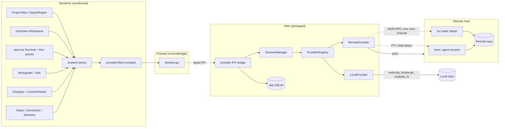
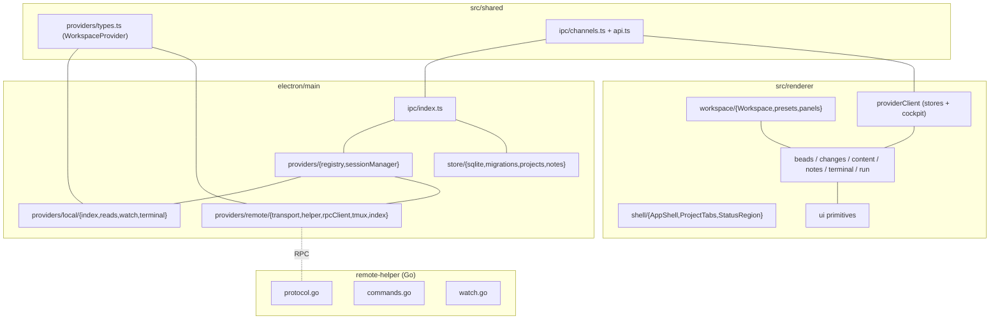

<!-- AI NOTE: doc_standard=engineering-docs-standards; version=2; doc_kind=design -->

# Design

## Overview

### Summary

The Agent Cockpit is an Electron app with a sandboxed React renderer and a
capability-bearing main process. The defining abstraction is the
**`WorkspaceProvider`**: a transport-agnostic interface the renderer's panels
consume for terminal, git, filesystem, beads, watch, and lifecycle, regardless
of whether the active project is local or accessed over SSH. Two
implementations — `LocalProvider` and `RemoteProvider` — satisfy it, and panels
never know which transport backs the active provider. This document covers the
implementation-level realization of the requirements; the durable cross-cutting
structure (seam, three-tier remote topology, session lifecycle, boundaries)
lives in [docs/ARCHITECTURE.md](ARCHITECTURE.md).

<!-- AI NOTE: source: src/shared/providers/types.ts:148 (WorkspaceProvider interface) -->

### Diagram



## Use Cases

### UC-1 Drive a Local Agent and Review Its Edits

#### Summary

A user adds a local repository, runs a CLI coding agent in the embedded
terminal, and watches the resulting changeset update live in the read-only
surfaces.

#### Walkthrough

1. The user adds a local project; `addProject` persists a `local` row in
   `agent_cockpit_projects` with the `LocalConnectionSpec` JSON, and the
   `ProjectTabs` strip shows it.
2. Activating it calls `projects:activate`. `SessionManager.activate` opens a
   `LocalProvider` if not already live (connect is immediate — local has no
   transport) and sets/persists `activeId`; other live sessions are left fully
   active (no suspend).
3. `Workspace` applies the project's saved Dockview layout (or the default
   `edit` preset) and `TerminalPanel` calls `terminal:open`. The provider
   attaches a `node-pty` to the terminal's `tmux` session bound to the repo root
   and streams `evtTerminalData` to xterm.
4. The user runs an agent; it edits files. `LocalWatchManager` (chokidar,
   debounced, pausable) emits `evtWatch`, which the renderer uses to refetch the
   changeset and beads graph for the active worktree.
5. `ChangesPanel` lists files (status badges, filter/search). Selecting one
   loads it into `ContentViewer`, which picks a mode by extension: unified diff
   via `parsePatch`, rendered Markdown with `mapHunksToBlocks` changed-block
   callouts (with inline Mermaid + Graphviz diagrams), raw, or image-compare.
6. The user marks reviewed state, leaves notes (`notes:create`), and the
   since-seen queue separates "changed now" from "already reviewed".

#### Details

Concrete example: editing `docs/DESIGN.md` produces a chokidar event on the
repo root; the renderer refetches `provider:getChangeset` for the worktree,
`ContentViewer` defaults `.md` to rendered Markdown, and `mapHunksToBlocks`
flags the changed paragraphs with `[changed]` callouts without scrolling the
panel.

#### References

<!-- AI NOTE: source: electron/main/providers/local/index.ts:43 -->
<!-- AI NOTE: source: electron/main/providers/sessionManager.ts:41 -->
<!-- AI NOTE: source: src/renderer/content/ContentViewer.tsx, src/renderer/content/hunkMap.ts -->

### UC-2 Connect a Remote Project and Survive a Dropped SSH Link

#### Summary

A user adds an SSH target, the cockpit auto-provisions the Go helper and
attaches a persistent tmux session, and a dropped link reconnects to the same
agent session with scrollback intact.

#### Key Design Rationale

Persistence and read access are split across two channels on purpose: the
interactive agent runs inside `tmux` over a PTY shell channel (so it survives
disconnect/restart), while the helper RPC runs on a separate exec channel so
read/diff/watch traffic never pollutes terminal scrollback. The host does the
watch/diff/read work and streams results — the client never mounts or mirrors
the tree (VS Code Remote-inspired thin client).

#### Walkthrough

1. The user adds a `remote` project (host/user/port/identity + remote path);
   the spec is persisted as JSON in `agent_cockpit_projects`.
2. Activation creates a `RemoteProvider`, which builds its transport via
   `createRemoteTransport()` (the `Ssh2Transport` default). `transport.connect`
   performs the ssh2 handshake (explicit identity file, else `$SSH_AUTH_SOCK`
   agent) and verifies the host key against `known_hosts`, mapping failures to a
   typed `RemoteTransportError` with a phase (incl. `hostkey`). For remote,
   `connected` is reported only after the helper RPC is ready (after `launch()`),
   so a read at `connected` never hits "helper unavailable".
3. `RemoteHelperLauncher.launch` runs `uname -sm`, selects the matching binary
   from the local `remote-helper/dist` manifest, SFTP-uploads it to
   `~/.agent-cockpit/helper-<version>-<os>-<arch>` (skipped if already present),
   `chmod +x`, launches it on an exec channel, and handshakes. A protocol-version
   mismatch re-provisions and relaunches once, else hard-fails.
4. `RemoteTerminalManager.open` runs `tmux -L agent-cockpit new-session -A -s
   agent-cockpit-terminal-<projectId>-<key>` over a PTY shell channel
   (attach-or-create, on a dedicated socket). The agent runs inside tmux.
5. Read surfaces call helper RPC methods (`gitStatus`, `gitDiff`,
   `listWorktrees`, `readFile`, `stat`, `watch`). Beads are read by fetching
   `.beads/issues.jsonl` via `readFile` and parsing client-side (no dependency
   on `br` being installed remotely).
6. On a dropped link the transport transitions to `disconnected`/`reconnecting`;
   reattaching opens a fresh shell channel that re-attaches the same tmux
   session — the agent kept running and tmux repaints scrollback.
7. All connection transitions flow through a per-project `ConnectionMachine`
   (main) with guarded transitions; it is the single source of connection
   status, forwarded to the renderer via one `evt:status`. A user can toggle the
   connection from the status bar (connect / confirm-then-disconnect); a
   user-initiated disconnect tears down the terminal control session, disposes
   the project's pane registry entries and IPC control/terminal caches, and
   clears panels — reconnect rebuilds a fresh provider and re-acquires the
   terminal. See ARCHITECTURE.md → "Connection State Machine (invariant)".

#### Details

Concrete example: with `remotePath=/srv/repo`, `getChangeset('', undefined)`
calls `rpc.gitStatus('/srv/repo', undefined)`; helper porcelain codes are mapped
by `mapGitStatus` (`??`→untracked, `R`→renamed, `U`/`AA`/`DD`→conflicted, …) and
assembled into the shared `Changeset` shape.

#### References

<!-- AI NOTE: source: electron/main/providers/remote/index.ts:139 -->
<!-- AI NOTE: source: electron/main/providers/remote/transport.ts:92 -->
<!-- AI NOTE: source: electron/main/providers/remote/helper.ts:267 -->
<!-- AI NOTE: source: electron/main/providers/remote/tmux.ts:42 -->

### UC-3 Switch Projects Without Losing Background Sessions

#### Summary

Switching the active project only moves `activeId`; every other live session stays
fully active (terminal, watch, and helper RPC keep running), so its Changes and
Workgraph data stay current and a return is instant — no warm/hot distinction.

#### Walkthrough

1. The user picks another project in the tab strip (click or `Cmd/Ctrl+1..9`);
   `projects:activate` runs.
2. `SessionManager.activate` only sets/persists `activeId`; it does **not** pause
   any other session (`suspend()`/`resume()` are removed). Every live session's
   PTY/tmux, watch subscription, and helper RPC stay live.
3. Because each live session keeps receiving `projectId`-tagged watch events,
   `panelDataSync` keeps each project's `byProject` slice current in the
   background; the newly active project's slice is already warm, so its Changes
   and Workgraph panels render immediately with no fetch-on-switch spinner and
   never another project's data.
4. The renderer rebinds its active-slice selectors to the new `activeId` and
   restores its saved per-project layout via `api.fromJSON`. Restoring the layout
   rebuilds the Dockview panel tree, but live xterm instances are not destroyed:
   they live in a module-level terminal registry (see Terminal & Run) keyed by
   `(projectId, kind, key)`, and `XtermView` only reparents the cached container
   into the rebuilt panel. The previously active project's terminal keeps running
   in the background with scrollback intact.

#### References

<!-- AI NOTE: source: electron/main/providers/sessionManager.ts:41 -->
<!-- AI NOTE: source: electron/main/providers/local/index.ts:140 ; electron/main/providers/remote/index.ts:301 -->

## Data and State Design

### Summary

Persistent app-local state lives in a single SQLite database under
`userData/`; transient renderer state lives in zustand stores keyed by the
active project. No repository data is ever written.

### Details

App-local SQLite schema (ordered migrations in
[electron/main/store/migrations.ts](../electron/main/store/migrations.ts),
tracked in `migrations(version)`):

- `settings(key, value, updated_at)` — key/value app settings.
- `layouts(scope, json, updated_at)` — `scope` is `global` or
  `project:<id>`; per-project Dockview layout overrides the global default.
- `agent_cockpit_projects(id, label, kind, connection_json, created_at,
  last_active_at, sort_order, run_command)` — the cockpit project registry;
  `kind` is `local`|`remote`, `connection_json` stores the full
  `ConnectionSpec`, `sort_order` is the user-controlled tab order (migration
  `0010`), and `run_command` is the Run panel command (nullable, migration
  `0011`).
- `agent_cockpit_active_project(singleton, id)` — single-row pointer (CHECK
  `singleton = 0`) to the active project id.
- `agent_cockpit_notes(id, project_id, target_kind, target_id, body, created_at,
  updated_at)` — local review notes; `target_kind` is one of
  `project|worktree|file|hunk|block|bead`.

The earlier v1 tables (`projects`, `review_state`, `notes`, `review_passes`,
`since_seen`) remain in the migration history but the cockpit reads/writes the
`agent_cockpit_*` tables; migrations never mutate a repository or beads
database.

Renderer zustand stores (selector-consumed so background-project changes do not
re-render the active view, the mechanism behind FR-3/NFR-5):

- `projectsStore` — project list + active id.
- `sessionStore` — per-project connection/session status.
- per-surface stores: `changesStore` and `beadsStore` hold one
  `byProject[projectId]` slice per live session (worktree/baseline/changeset/
  selection for Changes; graph/selection/view for Workgraph), with active-slice
  selectors deriving `byProject[activeId]` so a backgrounded session's data stays
  current and a switch never shows another project's data; `notesStore`
  (per-target notes). A single `panelDataSync` orchestrator loads/refreshes/clears
  slices off per-session connection status + `projectId`-routed watch events.
  External IPC/watch results are written into stores via `set` from outside React,
  keeping panels declarative.

## Detailed Design

### Summary

Main owns the providers, session lifecycle, IPC bridge, and SQLite store; the
renderer owns the shell, workspace, panels, primitives, and provider client.
`src/shared/` holds the typed IPC contract and the `WorkspaceProvider` type.

### Walkthrough

The provider seam realizes the primary flows as follows:

- **Provider seam.** `WorkspaceProvider`
  ([src/shared/providers/types.ts](../src/shared/providers/types.ts)) declares
  lifecycle, terminal, git, fs, beads, and watch (no suspend/resume — every live
  session stays fully active). `LocalProvider` delegates to `reads.ts`
  (simple-git/fs/beads), `watch.ts` (chokidar), and `terminal.ts` (node-pty).
  `RemoteProvider` delegates to a `RemoteTransport` (`Ssh2Transport` default, via
  `createRemoteTransport()`), `RemoteHelperLauncher` + `HelperRpcClient`, and
  `RemoteTerminalManager`.
- **Registry + SessionManager.** `ProviderRegistry.create` builds a provider
  from `{ projectId, spec }`; `SessionManager` holds at most one provider per
  project and a single `activeId`, owning open/activate/close, the per-session
  watch lifecycle, and the idle-activity tracker. All live sessions stay fully
  active; the live set is bounded by explicit kill and the remote-only idle reaper.
- **IPC bridge.** [electron/main/ipc/index.ts](../electron/main/ipc/index.ts)
  registers typed handlers that route renderer calls to the active provider via
  `activeProvider()` and to the SQLite store, validate inputs at the boundary,
  and forward provider push events (`evtTerminalData`, `evtTerminalExit`,
  `evtWatch`, `evtStatus`) to the renderer. `src/shared/ipc/` is the contract
  source of truth (`Channels` + `RendererApi`), exposed as `window.api` by
  preload and wrapped as `cockpit` in `providerClient`.
- **Terminal & Run (session-per-tab backend, default).** Both surfaces share
  one terminal seam. The live xterm instances are owned by a module-level
  registry ([terminalRegistry.ts](../src/renderer/terminal/terminalRegistry.ts))
  keyed by `(projectId, kind, key)`, decoupled from React/Dockview lifecycle:
  `acquire` builds the xterm + fit addon in a detached container, opens the PTY
  once via `terminal:open`, and subscribes to `evtTerminalData`/`evtTerminalExit`
  filtered by **both** `projectId` and `terminalId` (the bare key is not unique
  across projects, so id-only matching would let two projects' `t1` streams
  cross). `XtermView` is a thin view that reparents the registry container into
  its host on mount and detaches (never disposes) on unmount, so terminals
  survive layout rebuilds and project switches; the instance is disposed only on
  an explicit tab close. The host keys terminal subscription disposers by
  `(projectId, terminalId)` for the same reason. `terminal:resize` pushes size
  on fit. Each terminal is its own `tmux` session
  (`agent-cockpit-terminal-<projectId>-<key>`); `TerminalPanel` is a tab strip
  of them. The `RunPanel` reuses `XtermView` with `kind: 'run'` against a single
  per-project `agent-cockpit-run-<projectId>` session, plus an editable command
  bound to the project's `run_command`; Run writes `"<command>\n"` into the tty
  and Stop sends Ctrl-C (write-to-tty, so no separate run IPC). Both managers
  use a dedicated `agent-cockpit` socket so sessions persist and stay isolated
  from the user's tmux; `listTerminals` filters the terminal namespace so the
  run session never shows as a tab. Each tty surface has a reset control
  (TerminalPanel header for the active tab, RunPanel header) that calls
  `registry.reset` — renderer teardown without a kill — so the view re-acquires
  and reattaches the same tmux session, recovering a wedged tty. A background
  reaper (`startReaper`/`sweepIdle`) disposes terminals that are detached from
  the live DOM (i.e. belong to a non-active project after a switch) and idle past
  ~30 min, keeping the tmux session so returning to the project reattaches it;
  the active project's tabs stay connected and are never reaped.
- **Terminal (control-mode backend, opt-in).** When `terminalBackend` is
  `control-mode`, the terminal panel mounts
  [`ControlTerminalPanel`](../src/renderer/tmux/ControlTerminalPanel.tsx)
  instead of `TerminalPanel`, and `RunPanel` rebinds onto a distinguished pane
  of the same control session. Layering:
  - **Shared protocol** ([src/shared/tmux/](../src/shared/tmux/)) is the pure,
    transport-agnostic core: a streaming
    [parser](../src/shared/tmux/parser.ts) that frames `%begin`/`%end`/`%error`
    reply blocks, decodes `%output` octal-escaped bytes, and types every
    handled `%`-notification; a [layout parser](../src/shared/tmux/layout.ts)
    that turns tmux's window-layout string into a `{ dir: 'lr'|'tb', children }`
    / `{ paneId, w, h, x, y }` tree; an output [codec](../src/shared/tmux/codec.ts)
    and hex `send-keys` builder; and [command builders](../src/shared/tmux/commands.ts)
    for structure/size/input operations. The parser accepts `string |
    Uint8Array` but the data path must feed it raw bytes — see the raw-byte
    invariant in [docs/ARCHITECTURE.md](ARCHITECTURE.md#terminal-lifecycle-decoupling-invariant).
  - **Host control-session manager** owns one `tmux -L agent-cockpit -CC
    new-session -A -s agent-cockpit-<projectId>` connection per project.
    Local ([electron/main/providers/local/tmuxControl.ts](../electron/main/providers/local/tmuxControl.ts))
    spawns it via `node-pty` with `encoding: null`; remote
    ([electron/main/providers/remote/tmuxControl.ts](../electron/main/providers/remote/tmuxControl.ts))
    runs the same protocol over the SSH shell channel and resyncs after
    reconnect. Commands are sequenced FIFO and tagged so tmux's `%begin`/`%end`
    correlates replies; input goes back as `send-keys -t %<pane> -H
    <hex-pairs>` to avoid quoting pitfalls.
  - **IPC bridge.** The host exposes `tmuxControl:open|close|command|input|
    resize|capture-pane` request channels and forwards parsed notifications on
    a single `evt:tmux` push channel ([src/shared/ipc/channels.ts](../src/shared/ipc/channels.ts)).
  - **Renderer state.** [`tmuxStore`](../src/renderer/tmux/tmuxStore.ts) is a
    zustand reducer keyed by `(projectId)` (single `activeProjectId`, slice in
    `byProject`) that ingests notifications into windows/panes/layout state.
    `evtTmux` is subscribed once globally so a project's slice keeps updating
    even when it is not the active project — switching back is instant.
    [`controlPaneRegistry`](../src/renderer/tmux/controlPaneRegistry.ts) is
    the per-pane xterm registry keyed by `(projectId, paneId)`; on `acquire`
    it builds the xterm in a detached container, binds the per-pane output
    sink, wires keystrokes to `tmuxControl:input`, and seeds prior scrollback
    via `capture-pane -peJ`. The capture seed is re-encoded from the parser's
    latin1-mapped string back to bytes before `term.write` to preserve C1
    control bytes (CSI/DCS/OSC) — feeding the seed through as a JS string
    breaks xterm's VT parser on any pane containing escape sequences. The
    seed is also skipped when the captured content is all blank, so a fresh
    pane does not flash an empty viewport.
  - **View binding.**
    [`PaneXterm`](../src/renderer/tmux/PaneXterm.tsx) is the React view that
    reparents the registry container into the current panel host; tabs are
    driven from `%window-add`/`%window-close`/`%window-renamed`, and split
    layouts from `%layout-change`. Pane focus tracks
    `%window-pane-changed`/`%session-window-changed`. Tab labels prefer the
    SCREEN-style title (`\ek...\e\\`, extracted by
    [`extractScreenTitle`](../src/renderer/tmux/extractScreenTitle.ts)) over
    the window name when the running program sets one.
  - **In-place tab refresh (two tiers).** The tab toolbar refresh control has two
    modes (`refreshActiveTab(hard)`). Both repaint every pane from xterm's OWN
    buffer (`recoverTab` — refit + glyph-atlas rebuild + `term.refresh()`, never a
    dispose/remount) and then force a real client resize round-trip
    (`nudgeClientSize`: shrink one row, restore next frame). The round-trip is the
    key fix for size/reflow desync: tmux only re-emits `%output` (and SIGWINCHes
    the pane apps) when the client size actually CHANGES, so a same-size push is a
    no-op — which is why a plain repaint rarely fixed mis-wrapped output. The
    resize starts **synchronously** at click time so it targets the project active
    then; the next-frame restore is guarded on `activeProjectId` so a fast project
    switch never resizes the wrong project. **Shift-click** is a *hard refresh*
    (`hardRecoverTab`): one `list-panes` round-trip reads each pane's
    `#{alternate_on}`, then panes positively on the NORMAL screen are
    destructively re-seeded from `capture-pane` (`reseedPane` — clear + re-write,
    reusing the latin1 re-encode seed path) for deep desync, while alternate-screen
    panes (a live TUI) get only the non-destructive repaint and rely on the resize
    round-trip's redraw — re-seeding them would runaway-scroll. Safe default
    (`mayReseed`): re-seed ONLY when positively normal-screen; unknown /
    query-failed / alternate fall back to repaint. A structured diagnostic entry
    (project/window/pane ids, sizes, layout, `trigger=manual-refresh|hard-refresh`)
    is logged — no buffer dump. Both modes work identically on local and remote
    (`capturePane`/`resizeClient`/`command` exist on both transports).
  - **New-split focus.** A split issues `split-window … -P -F '#{pane_id}'` and
    records the reply's pane id as a pending-active pane; the active-pane
    resolution prefers it once it appears in `layout`, moving **both** the visual
    selection and xterm keyboard/input focus to the new pane (previously only the
    visual selection moved, leaving input focus on the original pane).
  - **Run tty in control mode.** The Run panel rebinds onto a distinguished
    pane (typically a `run` window) of the project's control session; Run
    writes the command via `send-keys`, Stop sends `C-c`. The Run panel is
    **optional** (see Run Panel Optional below): when `showRunPanel` is off, the
    control session's `reconcile()` does not create `run-1`, and the panel
    creates it on demand if opened from the Panels menu.
  - **Backend switching.**
    [`switchTerminalBackend`](../src/renderer/terminal/backendSwitch.ts) flips
    the `terminalBackend` setting; before persisting, it kills every cockpit-
    socket session and disposes both registries so the new backend starts from
    a clean slate. The terminal panel remounts and re-initializes for the
    chosen backend.
  - **Known issue.** At very tight split widths (one pane roughly prompt-
    wide), three independent layers (tmux's layout math, xterm's FitAddon
    floor, React's flex rounding) can disagree by one cell and zsh's `%`
    missing-newline marker appears on the next prompt. The trade-off was
    accepted because every compensating push strategy explored either drifts
    the same way under `floor()` or self-loops on tmux's layout-change ack;
    resizing the panel/window forces a clean `pushClientSize` and clears the
    ghost.
- **Run Panel Optional.** The Run panel is gated by a global `showRunPanel`
  setting (`src/shared/settings.ts`, **default off**) surfaced as a checkbox in
  `SettingsDialog`, because it consumes vertical space and is not always wanted.
  The setting gates two things: the layout **presets** (`presets.ts`) add the Run
  panel only when it is on, and the control session's `reconcile()` creates the
  reserved `run-1` window only when on (`ensureWindows` passes
  `createRun: settings.showRunPanel` to the pure `reconcile()` in
  [controlSession.ts](../src/renderer/tmux/controlSession.ts)). The Run panel
  stays available in the Panels
  reopen menu regardless, and opening it while off (no `run-1`) creates the window
  **on demand** from `RunPanel`. Turning the setting off never reaps an existing
  `run-1`, and the duplicate-`run-N` dedup in `reconcile()` is unchanged — the
  setting gates **creation only**.
- **Workgraph.** `BeadsPanel` renders the active project's beads task graph
  (`provider:getTaskGraph`) in one of **four** per-project, persisted views
  (`WorkgraphView = flat | graph | tree | columns`) toggled from the panel header.
  The **flat** view is a status-grouped list ordered **blocked → in_progress →
  ready → closed** (attention-needing work first); the "blocked" group is
  **derived** — a non-terminal issue with open `blocks` predecessors
  (`hasOpenBlockers`) groups as blocked regardless of its stored status, so a
  dep-blocked `open` task no longer hides in `ready`. Within any group, ordering is
  the status order, then priority ascending, then **natural (numeric-aware) id
  order** (`compareBeadId`, Intl `{ numeric: true }`) so a `.9` sequence suffix
  sorts before `.10` instead of lexically. The **graph** view (`GraphView`) anchors
  on the selected issue (or a sensible default via `resolveAnchorId`), lays out a
  few hops around it with `focusedSubgraph`, and draws SVG `blocks` edges plus
  status-toned node cards; clicking a node re-anchors by selecting it. The **tree**
  view (`TreeView`) renders the parent-child hierarchy (`parent`/`parent-child`
  deps): roots (no parent) at top level, children nested and collapsible
  (cycle-guarded) — **including inside the single-node focus view** — each row
  reusing the flat row's status color + priority + open-blocker badge and the FR3
  sibling ordering.

  The **columns** view (`ColumnsView`) is a side-by-side layout for working two (or
  more) epics in parallel: one independently-scrollable column per pinned epic,
  each rendering that epic's subtree via `TreeView` in single-root mode (`rootId`).
  The pinned set is the per-project **focus set** `focusEpicIds` (pin order),
  persisted via the `wg-focus-set` focusMemory key and reconciled on each graph
  load to ids that still exist **and** are epics. Epics are pinned/unpinned with a
  ★/☆ toggle (`PinButton`) on epic rows (List, Tree) and epic graph nodes, or
  unpinned from a column header's ×; `pinEpic`/`unpinEpic`/`clearFocusSet` own the
  set. The comfortable column count is the global setting
  `workgraphColumnsSoftCap` (default 2, clamped [1,6]); the layout is N-capable and
  **warn-and-allow** — beyond the cap the column is still shown with a non-blocking
  density notice, and raising the setting suppresses it at the higher count. An
  empty focus set shows a pin-epics prompt.

  All four views share `selectedId`/`select()` with `TaskDetail` (clicking a
  node/row in any view — or any column — selects it). The view flag persists per
  project in `localStorage`. The views are read-only navigation; beads mutation
  lives only in `TaskDetail` (comments / add-child / lifecycle).
- **Sessions.** `SessionsDialog` is a management modal (opened from a Sessions
  button in the Terminal panel header, mirroring Manage Projects — not a dock
  panel) that lists `tmux` sessions on the cockpit socket via `sessions:list` and
  supports `sessions:kill` / `sessions:kill-detached` plus a copyable manual
  attach command. It spans the local socket regardless of the active project, so
  orphaned sessions from removed projects stay manageable.
- **Project tabs.** `ProjectTabs` is the top strip: drag-to-reorder (persisted
  via `projects:reorder` → `sort_order`), `Cmd/Ctrl+1..9` activation by tab
  position, add-local / add-remote dialogs, and a Manage Projects dialog that
  gates removal behind an inline confirm (so a stray click can't drop a
  project).
- **Watch (layered filesystem watch subsystem).** Four separated layers; see
  [`docs/ARCHITECTURE.md` → Filesystem Watch Subsystem](ARCHITECTURE.md) for
  the full layer breakdown and the single-source invariant. Implementation
  summary:
  - **Policy** (`src/shared/watch/policy.ts`): the single source of `WatchCategory`
    (`working-tree | git-state | beads`), `classifyWatchPath`, `deriveWatchSpec`,
    `isHiddenFromChanges`, and `WATCH_DEBOUNCE_MS`. No Node deps; importable by
    main and renderer.
  - **Local mechanism** (`electron/main/providers/local/watch.ts`): three watchers
    per subscription, all policy-driven — (1) a **working-tree watcher**
    (`workingTreeWatcher.ts`); (2) a native Node `fs.watch` on `.git/`
    non-recursive for `HEAD`/`packed-refs` events; (3) a native Node `fs.watch`
    on `.git/refs` recursive. The working-tree watcher is platform-split: on
    **macOS/Windows** it is a single OS-level recursive `fs.watch(root,
    {recursive:true})` (FSEvents / ReadDirectoryChangesW) — one handle for the
    whole subtree, no upfront tree walk, no per-file FD; on **Linux** it is
    chokidar, because Linux has no recursive inotify (`fs.watch({recursive:true})`
    is emulated per-directory and cannot prune `node_modules` before adding
    watches, so chokidar's `ignored`-pruned descent adds fewer inotify watches).
    The whole-tree *coverage* (tracked + untracked, so new files are caught) is
    required for the Changes panel; the per-FD cost on macOS was only chokidar
    v4's walk-and-watch-per-dir implementation, removed by the native path. Both
    paths apply the same `gitignore + excluded-segment` predicate (the native
    path filters in the event callback; chokidar via `ignored`). Directory-level
    `fs.watch` routes through libuv's FSEvents on macOS, detecting git's atomic
    temp+rename pattern deterministically. No per-file descent into `.git`/`.beads`,
    no FD pin on `beads.db`. Both `.git` watchers fail silently on non-git repos.
  - **Remote mechanism** (`remote/index.ts` + `rpcClient.ts`): sends the derived
    `WatchSpec` in the `watch.subscribe` RPC. The Go helper (`remote-helper/watch.go`)
    is driven by the received spec — it does not hardcode its own `excludedDirs`.
    This closes the remote auto-refresh gap: `br` flushes, commits, and branch
    switches now produce events on the remote host and auto-refresh the Changes and
    workgraph panels without a manual refresh.
  - **Ingest** (`electron/main/watch/ingest.ts`): one pipeline per active project;
    normalizes paths to repo-relative POSIX, classifies with `classifyWatchPath`,
    debounces + coalesces with `WATCH_DEBOUNCE_MS`, suppresses `-wal`/`-shm` echo,
    and emits `CanonicalWatchEvent { categories, paths[{ rel, category }], at }`.
  - **Dispatch**: main forwards canonical events over `evt:watch` IPC; renderer
    hub (`src/renderer/watch/hub.ts`) routes to subscribers by `WatchCategory`
    interest. Changes store → `interest: ['working-tree', 'git-state']`; beads
    store → `interest: ['beads']`; explorer → `interest: ['working-tree']`. No
    store re-implements path filtering.
  - **Changes surface filter**: `ChangesPanel` applies `isHiddenFromChanges(rel, { showAll })`
    to changeset rows. `.git`/`.beads` are hidden by default; the `showAllChanges`
    setting (`src/shared/settings.ts`) reveals them. The changeset is complete in
    main — surfacing is a renderer display concern.
  - **Diff-target selector**: a toolbar `Select` in `ChangesPanel` lets the user choose
    between *Working tree vs HEAD* (default) and *Branch point (vs `<parentRef>`)*.
    The branch-point target uses `getChangeset` / `getFileDiff` with the resolved
    `mergeBase` SHA as the `baseline` param — the same baseline param already consumed
    by both the local and remote providers. The resolved `parentRef` is shown in the
    selector label so the user sees exactly what branch they are comparing against.
    The diff target, resolved `BranchPoint`, and current `baseline` are stored per-project
    in `changesStore.byProject[projectId].{target, branchPoint, baseline}`. On every
    watch-triggered or manual refresh, `changesStore.refresh()` re-calls
    `provider.resolveBranchPoint(worktreePath, projectId)` before issuing `getChangeset`,
    keeping the branch-point live as HEAD and the parent advance. When
    `resolveBranchPoint` returns `null` (orphan branch or no remote-tracking parent),
    the store falls back to HEAD diff and surfaces a "no parent" label. `getFileDiff`
    for the per-file view receives the same `baseline` from the content selection, so
    the row list and file diff always agree. For the provider capability and Go handler
    details, see the architecture doc: [Changes View — Diff Targets](ARCHITECTURE.md).
  - Each live session owns exactly one watch subscription (main-owned, started on
    `connected`, stopped on disconnect/eviction); every live session fans out its
    `projectId`-tagged events, and the renderer `panelDataSync` routes by
    `(projectId, category)` to the right `byProject` slice.
- **Content viewer.** `ContentViewer` selects a mode by extension and content:
  `DiffView` (`parsePatch`), `markdown.tsx`, `mermaid.tsx`/`graphviz.tsx`
  (inline diagrams), `RawFile`, `ImageCompare`. The Markdown renderer runs one whole-document
  unified pass (`remark-parse` → `remark-gfm` → `remark-rehype` →
  `rehype-highlight` → a local safe-link/image transform → `rehype-stringify`)
  so reference link definitions, footnotes, and reference images resolve
  across blocks. Top-level mdast nodes attach `data.hProperties` with
  `data-start-line`/`data-end-line`, which the renderer reads off the parsed
  DOM to drive `hunkMap` changed-block callouts. Mermaid (` ```mermaid `) and
  Graphviz (` ```dot `/` ```graphviz `) `code` nodes are swapped pre-rehype for
  sentinel `<div data-mermaid-id="…">` / `<div data-graphviz-id="…">`
  placeholders, then substituted with `MermaidFrame` / `GraphvizFrame` React
  components at render time. Both render to SVG (mermaid in `securityLevel:
  'strict'`; graphviz via the bundled, inlined `@hpcc-js/wasm-graphviz`), which
  is DOMPurify-sanitized before insertion and shown in a shared zoom/pan/source
  `DiagramFrame`; no CDN or network is used (the inlined WASM loads same-origin
  under the strict `script-src 'self' 'wasm-unsafe-eval'` CSP). External anchors get `target="_blank"` +
  `rel="noopener noreferrer"` and a delegated click handler routes them
  through `window.open` (Electron's `setWindowOpenHandler` funnels that to
  `shell.openExternal`); relative/`javascript:` anchors get `data-inert`;
  images with non-`http(s)`/`data:image/` `src` collapse to alt-text spans.
  Fenced code is highlighted by `rehype-highlight` using the base16
  Solarized hljs theme — token colors are theme-invariant across Solarized
  light/dark, and the base `.hljs` background/foreground is overridden to
  track the renderer's `--color-panel`/`--color-fg` tokens. Prose typography
  is scoped under `.agent-cockpit-markdown` in `src/renderer/styles.css` so
  Tailwind Preflight does not strip differentiated headings, list markers,
  table borders, or blockquote chrome. **Find-in-file** (`FindBar` +
  `findInContent.ts`, opened by Cmd/Ctrl+F scoped to the content panel) searches
  the currently rendered content (rendered/raw/diff) using the **CSS Custom
  Highlight API** (`CSS.highlights` + `Highlight` + `Range`): `collectMatches`
  walks the content-root text nodes for case-insensitive hits and the matches are
  painted as `::highlight(find-match)` / `::highlight(find-active)` ranges WITHOUT
  mutating the DOM (so it is safe over React-rendered content). A `MutationObserver`
  re-collects when async Markdown finishes rendering; next/previous scroll the
  active match into view. Image mode has no text search.
- **Visual system.** `src/renderer/ui/` provides app-owned primitives (Button,
  Badge, Panel, Row, Toolbar, feedback) over Radix (Dialog, Menu, Select, Tabs,
  Tooltip); Dockview is themed via `dockview-theme.css` + token overrides.

### Diagram



### Details

Remote helper protocol: a length-prefixed (4-byte big-endian) JSON stream over
the SSH exec channel with three payload shapes — `request {id,method,params}`,
`response {id,result,error}`, and server-push `event {event,data}` (used for
`watch`). `PROTOCOL_VERSION = 1` on both ends; messages are capped at 16 MiB.
The Go helper is stateless beyond active watches; the codec
(`HelperRpcClient`) is decoupled from ssh2 so it is unit-testable over an
in-memory stream.

Dockview presets ship two arrangements built by
[src/renderer/workspace/presets.ts](../src/renderer/workspace/presets.ts):
**Edit** (`[ Workgraph / Task / Run ] [ Terminal ] [ Changes·Explorer / Content ]`,
the default for driving the agent) and **Review**
(`[ Workgraph / Task / Run ] [ Content ] [ Changes · Explorer · Notes ]`). In
both, the left column is a three-way vertical split — Workgraph (beads) over
Task (taskDetail) over Run — built by stacking each `below` the previous. The
default 3-column widths are proportional to the live workspace width at a
`1:center:1` ratio (`sideColumnWidth` = `width / (center + 2)`), defaulting to
`1:3:1`; panels are independent so the user can re-dock freely.

Layout is serialized to `localStorage` per project **and per view** (Edit/Review)
via `layoutKey(projectId, view)`, with the last active view persisted per project
(`activeViewKey`). Switching views restores that view's own saved layout rather
than reapplying the preset, and the key carries a `LAYOUT_VERSION` (currently
`8`) so a format/structure change invalidates stale saved layouts. A **Reset**
dropdown clears the current view's saved layout and reapplies the proportional
default at a chosen column ratio (`1:3:1`, `1:2:1`, or `1:1:1`).

### Terminal & Workgraph Feature Batch

A batch of control-mode-terminal, panel, and workgraph features layered on the
existing seams without new architecture (except the beads write surface, below).

- **Split-pane zoom.** tmux already reports the zoomed `visible-layout` and a `Z`
  window flag in `%layout-change`; the parser surfaces both. `WindowState` gains
  `isZoomed` + `visibleLayout`, the reducer mirrors them
  ([tmuxStore.ts](../src/renderer/tmux/tmuxStore.ts)), and the panel renders
  `visibleLayout ?? layout` — so a zoom driven from inside or outside the app is
  reflected with no extra round-trip. A per-pane hover button (placed clear of the
  xterm scrollbar lane) issues `resize-pane -Z`.
- **Byobu/screen keybindings.** A `byobuKeybindings` setting (default off) gates a
  capture-phase `keydown` listener on the control-terminal host that arms a 2 s
  `Ctrl+a` prefix (`stopImmediatePropagation` so the byte never reaches the pane)
  for z/n/p/a, plus `Shift+Arrow` pane nav. The handler reads the setting through a
  ref so toggling needs no re-bind; the ⌘ shortcuts are untouched.
- **Native arm64 spawn.** `withNativeArch`
  ([nativeArch.ts](../electron/main/providers/local/nativeArch.ts)) detects
  `sysctl.proc_translated`, probes `arch -arm64`, and (memoized) prefixes the three
  local pty spawn sites so a Rosetta-launched app still forks native shells;
  identity off-macOS / on probe failure; server-query calls are left alone.
- **Panel fullscreen.** A `PanelFullscreenContext` (in `ui/`, so the dependency
  points inward) is provided by the Dockview panel host from the live panel API
  (`maximize`/`isMaximized`/`exitMaximized`, re-rendered on
  `onDidMaximizedGroupChange`); the shared `PanelHeader` appends a maximize/restore
  control to every panel with no per-panel change, and is a safe no-op outside a
  host.
- **Workgraph focus.** `focusId` (persisted per project via `wg-focus`) drives a
  tree focus mode (`ancestorsOf` context path + `findTreeNode` subtree, filter
  suspended, collapse ignored) and a graph focus expansion that anchors on the
  focused node with `Infinity` hops via the existing `focusedSubgraph(graph, id,
  hops)`. A shared banner lives in `BeadsPanel`; the state filter persists per
  project (`wg-filter`, written synchronously in the toggle to avoid a stale
  cross-project write). Related-bead rows route through the shared
  `beadsStore.select`, and a completed (terminal-status) blocker is struck through.
- **Beads write surface.** See ARCHITECTURE → *Beads read/write split*: the `br`
  CLI seam ([runner.ts](../electron/main/beads/runner.ts)) with shared argv
  builders, five provider methods (local `spawnSync` / remote `beadsExec` RPC),
  five IPC channels, store actions that reload the graph on success and return
  `br`'s message inline on failure, and the TaskDetail comments/add-child/lifecycle
  UI.

### Control-mode renderer (`PaneRenderer`)

The concrete control-mode terminal is pluggable behind a `PaneRenderer` interface
(see ARCHITECTURE → *Control-mode renderer boundary*); `controlPaneRegistry` keeps
identity, the raw-byte sink, the seed, the reaper, and the cell cache, while the
adapter owns only the terminal (byte write, input, fit/measure, repaint, theming,
disposal). Two adapters:

- **`XtermPaneRenderer`** (`dom`/`webgl`, default + fallback) wraps the xterm
  `Terminal`/`FitAddon`/optional `WebglAddon`, the atlas-rebuild + `refresh`
  repaint, and the `_renderService` cell metric — the original behavior, lifted
  verbatim behind the interface.
- **`WtermPaneRenderer`** (`wterm`) uses `@wterm/dom`'s `WTerm` driven by a
  `@wterm/ghostty` `GhosttyCore` (real upstream libghostty). DOM rendering, so the
  browser font engine aligns powerline/nerd glyphs. The crux is async WASM init:
  the container is created synchronously while `GhosttyCore.load()` + `WTerm.init()`
  boot, with writes/onData/focus buffered and flushed in order once ready. Theme is
  the `XTERM_THEMES` palette mapped onto wterm CSS variables; sizing is left to
  wterm's `autoResize` tracking the tmux-driven container. Switching renderers
  rebuilds the active project's control panes on the new adapter without killing
  tmux (`switchTerminalRenderer`, the reconnect teardown). Known wterm 0.3.x gaps:
  no OSC-8 link API and no scrollback-limit setter (libghostty default).

## Observability and Recovery

Connection state (`disconnected`/`connecting`/`connected`/`reconnecting`/
`failed`), helper upload/launch progress, and per-project session status surface
in the rail and `StatusRegion` via `evtStatus`. Typed errors carry phase context
(`RemoteTransportError.phase`: auth/connect/timeout/identity/hostkey/unexpected;
`HelperLaunchError.phase`: manifest/detect/select/upload/launch/handshake) so
failures render inline rather than blanking the shell. Secrets and full key paths
are never logged. A remote session that ages out (idle reaper) sets a distinct
`ConnectionStatus.detail` cue so it is not mistaken for a network drop.

## Implementation Phases

The system was delivered in nine sequenced phases, each with a runnable
checkpoint:

1. **Foundations** — scaffold cleanup, Tailwind + tokens, UI primitives,
   Dockview theme, app shell + project rail, SQLite project model. Checkpoint:
   styled empty shell boots.
2. **Provider seam + Local** — `WorkspaceProvider` interface, `SessionManager`,
   `LocalProvider` (git/fs/beads reads + watch), renderer provider client.
3. **Terminal surface** — xterm.js panel, node-pty host, IPC streaming, resize.
   Checkpoint (P2–P3): working local terminal + project.
4. **Review surfaces re-home** — beads workgraph, changes list, content viewer
   modes, notes/since-seen on the provider seam.
5. **Layout** — presets, flip, per-project persistence/restore, responsiveness.
   Checkpoint (P4–P5): full local cockpit.
6. **Remote helper** — Go static binary, JSON-RPC protocol codec, commands,
   watch push, build/package + dist manifest.
7. **RemoteProvider** — ssh2 transport, SFTP helper upload/launch, RPC client,
   tmux attach/reattach, reconnect/backoff scaffolding.
8. **Observability/recovery** — connection/session states, error surfaces, safe
   restart/re-upload. Checkpoint (P6–P8): remote cockpit.
9. **Validation** — see [docs/TEST_PLAN.md](TEST_PLAN.md).
10. **Workbench increments** (post-foundation) — top project tab strip with
    drag order + `Cmd/Ctrl+number` switching and persisted `sort_order`; a
    Sessions panel over the cockpit `tmux` socket; namespaced terminal/run
    `tmux` sessions; and a per-project Run panel (saved `run_command`) as the
    third left-column split. Each is a small self-contained increment on the
    established seam.
11. **tmux control-mode backend** (additive) — pure shared protocol in
    `src/shared/tmux/`, host local/remote control-session managers, the
    `tmuxControl:*` / `evt:tmux` IPC slice, a renderer `tmuxStore` reducer +
    per-pane `controlPaneRegistry` + `PaneXterm` view, and a `terminalBackend`
    setting that selects between the session-per-tab default and control mode.
    Shipped alongside the per-key backend rather than replacing it; backend
    switching is a clean-slate operation.
12. **Layered watch subsystem** — single-source watch policy (`src/shared/watch/policy.ts`),
    refactored `LocalWatchProvider` (policy-driven), `RemoteWatchProvider` sending
    `WatchSpec` over `watch.subscribe` RPC, Go helper updated to consume received spec
    instead of hardcoding exclusions, main-side ingest pipeline
    (`electron/main/watch/ingest.ts`), renderer dispatch hub (`src/renderer/watch/hub.ts`),
    `showAllChanges` setting, and Changes surface filter. Closes the remote
    auto-refresh gap (FR-8 transport parity).

## Directory Structure

```
electron/main/
  providers/
    types.ts              # main-side provider type re-exports
    registry.ts           # ProviderRegistry.create({projectId, spec})
    sessionManager.ts     # background-live sessions, single activeId, per-session watch + activity tracker
    sessionReaper.ts      # remote-only idle aging-out (first periodic main timer)
    local/                # index, reads (simple-git/fs/beads), watch (chokidar), terminal (node-pty), tmuxControl (per-project -CC session)
    remote/               # transport (Ssh2Transport — only ssh2 importer), transportTypes/transportFactory (RemoteTransport seam), helper (SFTP launch), rpcClient (codec), tmux, tmuxControl (-CC over SSH shell channel), index
  ipc/index.ts            # typed provider IPC bridge + event forwarding (incl. tmuxControl:* and evt:tmux)
  watch/
    ingest.ts             # per-project ingest pipeline: normalize → classify → debounce → CanonicalWatchEvent
  sessions.ts             # tmux session inventory (cockpit socket) for SessionsDialog
  store/                  # sqlite, migrations, projects, notes
remote-helper/            # Go static helper: protocol, commands, watch, main, build
src/renderer/
  shell/                  # AppShell, ProjectTabs (top strip), StatusRegion
  ui/                     # owned primitives over Radix
  workspace/              # Dockview host, presets, panels, theme
  terminal/               # session-per-tab backend: XtermView, TerminalPanel, terminalRegistry, backendSwitch
  tmux/                   # control-mode backend: ControlTerminalPanel, PaneXterm, controlPaneRegistry, controlSession, tmuxStore, extractScreenTitle
  run/                    # RunPanel (per-project run command; binds to a tab-namespace tty or a control-mode pane)
  sessions/               # SessionsDialog (tmux session management modal, spans both backends)
  beads/ changes/ content/ notes/ explorer/   # read-only feature panels
  watch/
    hub.ts                # renderer dispatch hub: routes CanonicalWatchEvent by WatchCategory interest
  providerClient/         # cockpit proxy + zustand stores
src/shared/
  providers/types.ts      # WorkspaceProvider (the seam)
  ipc/                    # channels + api (typed IPC contract)
  tmux/                   # pure control-mode protocol: parser, codec, layout, commands, types
  watch/
    policy.ts             # SINGLE SOURCE: WatchCategory, classifyWatchPath, deriveWatchSpec, isHiddenFromChanges, WATCH_DEBOUNCE_MS
```

## Linked Documents

- [docs/REQUIREMENTS.md](REQUIREMENTS.md) — objective, scope, FR/NFR,
  acceptance criteria.
- [docs/ARCHITECTURE.md](ARCHITECTURE.md) — cross-cutting boundaries, runtime
  topology, ownership.
- [docs/TEST_PLAN.md](TEST_PLAN.md) — test strategy, scope, and known runner
  constraint.
