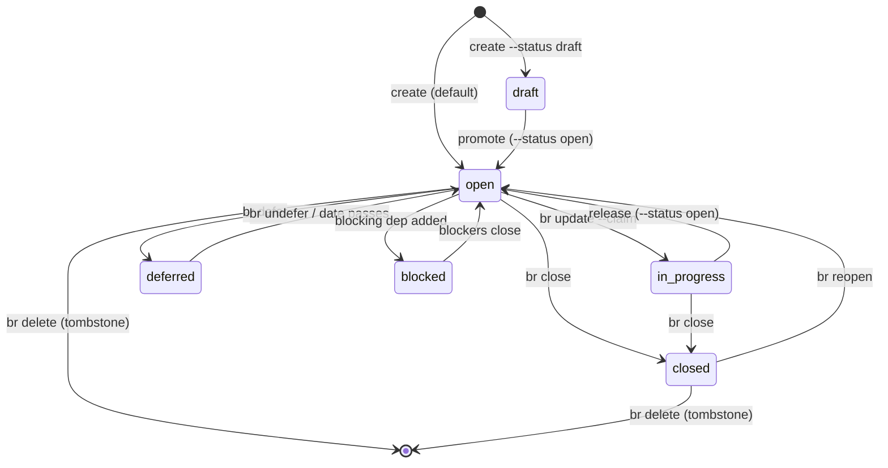

# Beads authoring rules (for agents operating `br`)

Drop-in guidance for any agent that creates, claims, defers, or closes beads
issues via the `br` (beads_rust) CLI. The goal is issue state that stays
**consistent** and renders correctly in Agent Cockpit's workgraph — and that is
portable to plain `br` use outside the app.

Agent Cockpit reads beads **read-only** (the SQLite DB locally, `.beads/issues.jsonl`
over the helper RPC remotely) and mutates state **only** through the `br` CLI (the
task-detail panel's close/reopen/comment/create go through the same seam). So what
you do in the terminal and what the app shows are the same source — following these
rules keeps them in agreement. Full model and rationale:
[DESIGN.md](DESIGN.md) "Bead lifecycle states & transitions" and
[ARCHITECTURE.md](ARCHITECTURE.md) "Workgraph Relationship & State Model".

## Rules

1. **Mutate only through `br` — never edit `.beads/` by hand.** Every write goes
   through the `br` CLI; it owns the audit trail, policy gates, WAL handling, and
   JSONL sync. Do **not** write `.beads/beads.db` or `.beads/issues.jsonl`
   directly. `.beads/issues.jsonl` is the source of truth and the DB is a
   rebuildable cache — if the DB is corrupt or writes fail, rebuild it from the
   JSONL (and upgrade `br` if writes still fail) rather than hand-patching either.
   Run `br init` once if the repo has no `.beads/` directory.

2. **Only `open` is ever ready.** `br ready` (what agents pick up) is defined as
   **`open` AND unblocked AND not-deferred**. Every other status —
   `in_progress`, `blocked`, `deferred`, `draft`, `pinned`, `closed`, `tombstone`
   — is *not* ready. If you want a bead to be pickable, it must be `open`.

3. **Claim before working: `br update --claim` (→ `in_progress`).** Mark a bead
   in progress the moment you start it so a coordinator or a parallel agent does
   not double-pick the same work. Release an unfinished claim back with
   `br update --status open`.

4. **Finish ONLY with `br close` — never a free-text status.** `br`'s status
   field `anyOf`'s the eight-value enum with a bare string, so **any** value
   validates (`br update --status done` *succeeds*). Resist it. `closed` is the
   one state that is both never-ready and truly terminal, and `br close` is the
   only thing that unblocks dependents and feeds `br changelog`. A free-text
   status (`done` / `completed` / …) lands the bead in **limbo**: not `open` (so
   it never shows ready again — looks abandoned) and not `closed` (so it keeps
   blocking its dependents and is dropped from changelogs). The cockpit renders
   any such value as **"Other status" (warn tone)** — never Ready, never hidden —
   precisely so the bad status is visible and gets corrected. Reopen with
   `br reopen`; remove with `br delete` (→ `tombstone`).

5. **Snooze with `br defer` / `br undefer`; don't hand-set `blocked`.** Defer a
   bead that shouldn't be picked up until later; `br undefer` (or the deferral
   date passing) returns it to ready. Leave `blocked` to dependency edges — it is
   normally *derived* from `br dep`, not set with `--status blocked`.

6. **Get dependency direction right: `br dep add <issue> <depends-on>`.** This
   records that **`<issue>` depends on `<depends-on>`**, so `<depends-on>` blocks
   `<issue>` — `<issue>` is the blocked/dependent side. Verify with `br blocked`,
   which lists the dependent issue as blocked by its dependency. `parent-child`
   edges (child → parent) are structural hierarchy, **not** a work blocker by
   themselves.

7. **Understand the three kinds of "blocked" — only the explicit flag is
   urgent.** Stored `status === 'blocked'` renders **red** (a deliberate flag,
   sorted to the top); an open `blocks` dependency renders **yellow**
   (`dep_blocked`, informational); an epic/parent with ≥1 open child renders
   **yellow** (`child_blocked`, app-derived — `br` does **not** auto-block
   epics). To express a dependency, add the dep edge and let the state derive;
   don't manually set `--status blocked`.

8. **Write substantive issue bodies; decompose substantial work.** No sparse
   one-line bodies. Capture objective, scope / planned touch set, guardrails,
   contract / acceptance criteria, and validation. Break substantial work into
   multiple linked beads with explicit dependencies instead of one mega-issue.
   Link the governing docs via `--external-ref` (or in the body) when `docs/**`
   is the source of truth — `br` tracks status and ordering, `docs/**` owns
   requirements and rationale; don't duplicate full design detail into the bead.

9. **Use stable, natural-ordered IDs; never duplicate a bead.** The workgraph
   sorts by bead id in natural (numeric-aware) order, so a `.N` sequence suffix
   orders sibling beads predictably. Reuse the same id for the same work; don't
   create duplicate or contradictory issues for one objective.

10. **Edit an unexecuted bead directly; don't race a running executor.** If
    planned work changes before an executor has picked the bead up, edit the bead
    itself — that is the source of truth for the work. Do not try to redirect an
    executor mid-flight out of band; correct the bead (or its dependencies) and
    let the graph drive.

## Lifecycle (the consistent transitions)

## Quick checklist

- [ ] All state changes go through `br` — never edit `.beads/beads.db` or `issues.jsonl` by hand.
- [ ] Claimed the bead (`br update --claim`) before starting work.
- [ ] Finished with `br close` — no free-text status (`done`/`completed`).
- [ ] Used `br defer`/`br undefer` to snooze; left `blocked` to dep edges.
- [ ] Dependencies added as `br dep add <issue> <depends-on>` and verified with `br blocked`.
- [ ] Issue body is substantive (objective, scope, guardrails, acceptance, validation); docs linked via `--external-ref`.
- [ ] Substantial work decomposed into multiple linked beads.
- [ ] Stable, natural-ordered ids; no duplicate beads for one objective.
