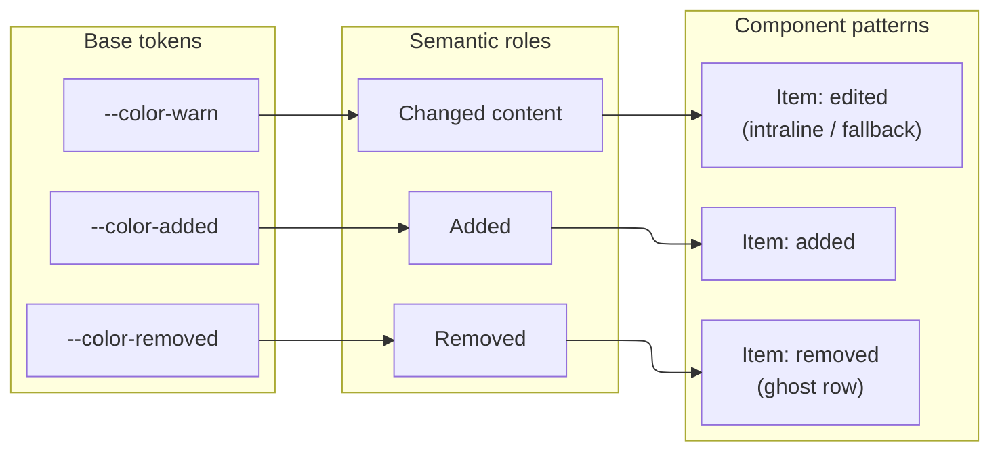

<!-- AI NOTE: doc_standard=engineering-docs-standards; version=2; doc_kind=design_breakout -->

# UI Design Language

## Summary

The durable home for this project's concrete styling/component decisions,
linked from [docs/DESIGN.md](../DESIGN.md). This record is seeded from the
tokens and component patterns actually exercised by the rendered-markdown
diff-highlighting design
([docs/design/ui-rendered-markdown-diff.md](ui-rendered-markdown-diff.md)) and
is expected to grow as other surfaces get their own design records; it is not
yet a full audit of every existing UI surface.

Where the language is already implemented, code is the source of truth for
exact values — this record states the role each token plays and links the
implementation, it does not duplicate value tables that could drift.

## Diagram

How base Solarized tokens map to semantic roles, and which component pattern
each role backs (this record's new additions only — see [Color
Roles](#color-roles) for the complete existing+new role table).

## Color Roles

Implementation: [src/renderer/styles.css](../../src/renderer/styles.css)
(Solarized Dark/Light `@theme` tokens, lines 6-58).

| Role | Token | Used for |
|---|---|---|
| Surface | `--color-bg` / `--color-panel` / `--color-panel-2` / `--color-elev` | Window/panel background, elevated surfaces (hover, popovers) |
| Text | `--color-fg` / `--color-dim` / `--color-muted` | Primary / secondary / hint text |
| Focus/selection | `--color-accent` | Selection, focus rings, links, and (today) the sole "this block changed" indicator |
| Structural boundary | `--color-edge` / `--color-edge-strong` | Dividers, borders, focus-ring-adjacent borders |
| Added | `--color-added` (green) | Diff-view added lines; reused by this design for "new list item" |
| Removed | `--color-removed` (red) | Diff-view removed lines; reused by this design for intraline deletions and ghost (removed) rows |
| Changed (content) | `--color-warn` (amber) | New in this design — a list item whose content changed, distinct from `--color-accent`'s existing "generic changed block" role |
| Info | `--color-info` | Currently aliased to the same value as `--color-accent`; reserved for structural (non-content) signals such as a future "renumbered, not edited" indicator |

Rationale for introducing `--color-warn` as a new semantic role: the existing
`--color-accent` "changed" treatment ([BlockView](../../src/renderer/content/markdown.tsx),
`ChangedTag`) marks an entire block with one meaning ("something in here
differs"). This design needs a *finer* distinction at the per-item level —
"this item's content changed" vs "this item is new" vs "this item was
removed" — so it borrows the diff view's already-established green/red
added/removed roles and adds amber for the one case diff-view doesn't have an
equivalent for (an edited-in-place line, as opposed to a paired del+add).

## Component Patterns

### Block-level change treatment (existing)

`BlockView` (`src/renderer/content/markdown.tsx`) wraps a changed top-level
rendered node in: `border-left: 2px solid var(--color-accent)`,
`background: rgba(91, 141, 239, 0.06)`, `padding: 8px`, plus an absolutely
positioned `ChangedTag` pill (top-right, `changed`, bordered, panel
background). This is the precedent this design's per-item treatment follows
at finer granularity — same left-rail + wash shape, applied to an `<li>`
instead of its enclosing block.

### Item-level change treatment (new — this design)

- **Edited (intraline-diffable):** left rail in `--color-warn`, `rgba(181,
  137, 0, 0.07)` background wash, no tag (the inline del/add spans already
  communicate "changed" without a label).
- **Edited (fallback, no clean intraline diff):** same rail/wash as above,
  plus a small `changed` mini-tag pill and the always-visible detail marker
  (below).
- **Added:** left rail in `--color-added`, `rgba(133, 153, 0, 0.10)`
  background wash, `new` mini-tag pill.
- **Removed (ghost row):** dashed left rail in `--color-removed`,
  `rgba(220, 50, 47, 0.05)` background wash, struck-through dimmed
  (`--color-dim`) text, `removed` mini-tag pill, muted list marker. No
  detail affordance — the visible text already is the full "before" state.

### Mini-tag pill (new)

Small pill: `font-size: 9.5px`, `border-radius: 999px`, 1px border in the
role color at ~45% alpha, background the same role color at ~10-12% alpha,
text in the role color. Used inline, immediately after an item's text.
Distinct from `ChangedTag` (which is absolutely positioned and block-scoped)
— the mini-tag flows inline with item text since items vary in height and
wrap.

### Intraline diff spans (new)

- Removed span: `color: var(--color-removed)`, `text-decoration:
  line-through`, `background: rgba(220, 50, 47, 0.14)`, `border-radius: 3px`.
- Added span: `color: var(--color-added)`, `background: rgba(133, 153, 0,
  0.16)`, `border-radius: 3px`, `font-weight: 600`.

Both sit inline in prose (no monospace font override — unlike the raw
`DiffView.tsx`, which is monospace throughout).

### Always-visible detail marker (new)

A native `
`/`
` disclosure, styled as a small (~16px)
rounded icon button (ⓘ), `color: var(--color-dim)` at rest, `--color-fg` on
hover/focus-visible with an `--color-elev` background. Chosen over a custom
JS popover so keyboard (Tab + Enter/Space) and screen-reader access come for
free. This reuses the interaction shape already established by
`BlockView`'s note-thread affordance (an expand-below-the-row disclosure),
not a new interaction pattern for the codebase — only the trigger's visual
form (icon button vs. hover-revealed "+") is new.

### Prose rail (new — non-list block extension)

Applied directly to `
`/`<h1>`-`<h6>`/a fenced code block
(`.ac-prose-changed`/`.ac-prose-added`/`pre.ac-code-changed`/
`pre.ac-code-added`, [src/renderer/styles.css](../../src/renderer/styles.css)):
the SAME rail colors as the item-level "edited"/"added" states
(`--color-warn`/`--color-added`), but a DISTINCT, deliberately lighter wash
alpha — `0.05`/`0.08` here vs. `0.07`/`0.1` for item-level — a role
distinction, not an oversight (a prior version of this record stated "same
wash colors," which the shipped values do not bear out): a standalone
top-level block (prose rail) reads as its own unit at a glance, so a lighter
wash keeps normal reading flow from feeling heavy across a whole paragraph
or code block, while an item-level row/list-item wash sits inside an
already-denser, already-inset list/table structure where a stronger wash
reads as "this row," not "this whole area." Also WITHOUT the mini-tag pill
on the clean path and without the item's inset/`margin-left` treatment — a
paragraph isn't nested inside a container the way a list item is, so it
keeps its normal block margins and gains only `border-left` + `background` +
slightly increased padding. Exact values are code-sourced (see the linked
stylesheet); this record states the role, not a value table that could
drift.

Table rows (`<tr>`) and blockquote children reuse the ITEM-level rail
colors rather than the prose rail, since they ARE contained children of a
multi-child container, structurally closer to a list item than to a
standalone paragraph — but the two do NOT share one wash-alpha story.
Blockquote children reuse the item-level states verbatim, including the
exact `0.07`/`0.1` wash alphas list items use (`blockquote >
.ac-item-edited`/`.ac-item-added` carry the identical declarations as
`li.ac-item-edited`/`.ac-item-added`). Table rows instead carry their OWN,
distinct — lighter, first-cell-scoped — wash alphas
(`tr.ac-item-edited`/`.ac-item-added` `td:first-child`/`th:first-child`);
exact values are code-sourced (see the linked stylesheet), not restated
here, per this record's own value-table-could-drift rule above.
Implementation notes not otherwise obvious from the rule shape alone:

- **Table row rail paints on the first cell, not the `<tr>` itself.**
  `border-collapse: collapse` means a table row's own box does not support a
  visible `border-left`/background the way `<li>`'s does, so the rail/wash
  live on `td:first-child`/`th:first-child` instead — see
  [ui-rendered-markdown-diff.md](ui-rendered-markdown-diff.md#decision--extension-non-list-block-types),
  "Tables".
- **Header rows decorate identically to body rows** (edited/added rail +
  wash, `th:first-child` mirroring `td:first-child`) and can never be
  ghosted/removed (a persisting table's header always pairs 1:1 against its
  old counterpart). Table added rows keep the `new` mini-tag pill (unlike
  the prose-rail "added" case, which is rail-only, no tag) — see
  [ui-rendered-markdown-diff.md](ui-rendered-markdown-diff.md#decision--extension-non-list-block-types),
  "Tables", for the full REJECT-corrected rationale.
- **Blockquote children get a legibility color override**
  (`color: var(--color-fg)`) layered on top of the reused item-level
  rail/wash: the enclosing `<blockquote>` sets `color: var(--color-dim)` for
  its own quoted text, which would otherwise dim a decorated child's own
  text and its intraline diff spans against the quote's already-muted
  styling. Blockquote children also OMIT the item-level `-10px`
  `margin-left` inset (like the prose rail, and for the same reason: a
  blockquote child isn't preceded by a list marker the way an `<li>` is).
- **Zebra restripe is a presentational-class mechanism, not a new color
  role.** A ghost `<tr>` shifts `:nth-child` parity for every following real
  row; `.ac-table-restriped`/`.ac-row-even` (computed by counting only
  non-ghost rows) keep every real row's stripe visually identical to a
  ghost-free render — no new token, no user-visible row index. See
  [ui-rendered-markdown-diff.md](ui-rendered-markdown-diff.md#decision--extension-non-list-block-types),
  "Tables", "Zebra-striping parity".

## Typography & Spacing (existing, reused as-is)

Implementation: `.agent-cockpit-markdown` rules,
[src/renderer/styles.css](../../src/renderer/styles.css) lines 89-229. List
items (`li { margin: 0.2em 0; }`) and list containers
(`ul, ol { margin: 0.6em 0; padding-left: 1.6em; }`) are unchanged by this
design; the new per-item treatments apply padding/border to the `<li>`
without altering these base rules.

## Linked Documents

- [docs/design/ui-rendered-markdown-diff.md](ui-rendered-markdown-diff.md) — the design record that introduced the new roles/patterns above.
