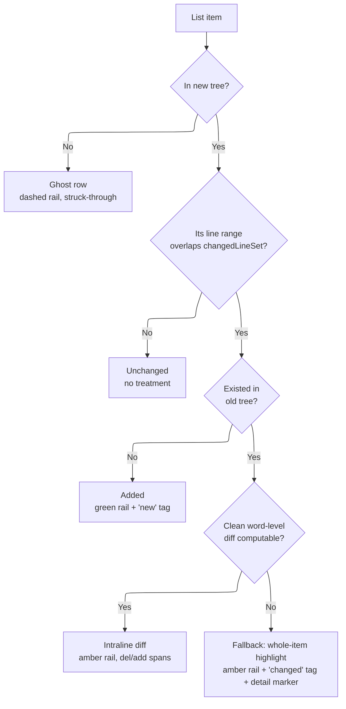
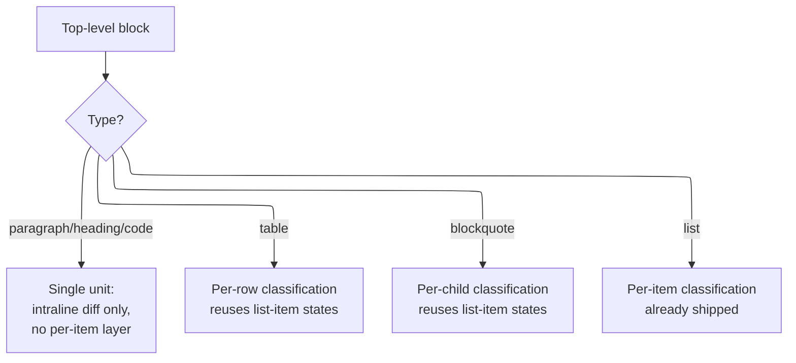

<!-- AI NOTE: doc_standard=engineering-docs-standards; version=2; doc_kind=design_breakout -->

# Rendered-Markdown Diff Highlighting

## Summary

The Content panel's rendered-markdown preview
([src/renderer/content/markdown.tsx](../../src/renderer/content/markdown.tsx))
highlights a changed markdown list by wrapping the ENTIRE `<ul>`/`<ol>` in one
`BlockView` treatment whenever any line inside it changed — so editing one
item marks every sibling item as "changed" too. This record decides moving
that decision to per-`<li>` granularity, adding intraline (word-level) diff
highlighting for the common case, a struck-through "ghost" row for deleted
items, and an always-visible detail marker reserved for the one case where
old/new text isn't otherwise both on screen. Master doc:
[docs/DESIGN.md](../DESIGN.md), "JSON/YAML source-mapped structural folding"
section — this is a sibling structural-content feature for markdown.

**Extension (this record, second pass):** the same over-broadening problem
and the same intraline-diff opportunity exist for every OTHER block type —
paragraphs/headings show a whole-block wash for a one-word edit, a table
marks its entire body changed for one row, a blockquote marks every one of
its paragraphs changed for one. [Decision — Extension: Non-List Block
Types](#decision--extension-non-list-block-types) generalizes intraline diff
to paragraphs, headings, and fenced code blocks directly, and generalizes
per-item classification (the same mechanism `list` got) to table rows and
blockquote children.

This is scoped to the rendered preview only. A separate, unrelated bug in the
raw line-diff view (`DiffView.tsx`/`parsePatch.ts`) — an ordered list's
renumbering cascade after an insert/delete — is out of scope here; see
[Alternatives](#alternatives).

## Diagram

Per-item render-time classification. Each `<li>` in the CURRENT (working-tree)
markdown is classified independently; there is no cross-item state.

The one runtime (not render-time) transition is the fallback item's detail
marker: closed (default) → open, triggered by click or keyboard
Enter/Space on its `
`, or a mouse-hover quick preview as a
non-authoritative convenience. It closes on a second activation or losing
focus/hover; nothing else in this design has a state that changes after
mount.

## Decision

Replace `RenderedMarkdown`'s current top-level-only `changed` check
(`rangeOverlaps` against a whole node's `[startLine, endLine]`, in
`markdown.tsx`) with per-item classification, for `list` nodes specifically
(other top-level node types — paragraph, heading, table, code — are
unaffected by this record and keep today's whole-block behavior):

### Decision — Item 1: Unchanged

No line in `[data-start-line, data-end-line]` (already annotated today via
`ANCHOR_NODE_TYPES`, currently used only for note-anchoring) falls in
`changedLineSet` → render with zero decoration.

### Decision — Item 2: Added

Present in the new tree, changed, with no corresponding item in the old tree
at all → green left rail (`--color-added`), `new` mini-tag. No detail marker
(nothing to compare against).

### Decision — Item 3: Edited (clean)

Present in both trees, changed, and a word-level diff between the old and new
item text can be computed and mapped back into the rendered HTML → amber left
rail (`--color-warn`), inline `.del-span`/`.add-span` around the actual
changed words, no tag, no detail marker (old and new are both already
visible).

### Decision — Item 4: Edited (fallback)

Same as Item 3 but a clean word-level mapping isn't possible (item contains a
link, nested inline formatting, or similar, where splicing diff markers into
the rendered HTML risks breaking markup) → amber left rail, `changed`
mini-tag, **and** the `
`/`
` detail marker revealing verbatim
before/after text. This is the only item state that carries the marker.

### Decision — Item 5: Removed (ghost row)

Present in the old tree, absent from the new tree → synthesized "ghost"
`<li>` reinserted at its original position (see below), dashed red left rail,
dimmed struck-through text, `removed` mini-tag, no detail marker (the visible
text already is the full "before" state).

**Ghost row positioning:** infer position from the nearest still-present
sibling items immediately before/after the deletion in the old tree (i.e.
the same context-line anchoring the diff hunk itself already establishes) —
the deleted item is inserted directly after the last unchanged sibling that
precedes it. When a deletion sits at a list boundary (first/last item), it
anchors to that boundary instead.

**Ordinal preservation (ordered lists; previously unsettled in this
record):** inserting any `<li>` into an `<ol>` increments the
browser's built-in list-item counter for every following sibling regardless
of `list-style` (which only hides a marker glyph — it never stops the
counter), so a spliced-in ghost would otherwise shift every real item's
displayed number by one. `markdown.tsx`'s `renumberOrderedList` compensates by
pinning every REAL item to an explicit `value` attribute equal to the ordinal
it would show with no ghost present (recomputed from scratch, so it stays
correct regardless of how many ghosts a list received); the ghost item itself
is left without a `value` and its own marker is suppressed entirely
(`ol li.ac-item-removed { list-style: none }`, `styles.css`) since it has no
real position to display.

**Fallback detection:** attempt the word-level diff first; treat it as
"clean" only when every diff span maps to a single, uninterrupted run of
rendered text nodes inside the item (no diff boundary falling inside an
element's start/end tag). This mirrors the existing graceful-degradation
shape elsewhere in the diff pipeline (e.g. `DiffView.tsx`'s per-line
tokenization already falls back to plain text when tokenization fails) —
fail toward showing SOMETHING correct (whole-item highlight) rather than
a corrupted intraline render.

### Decision — Extension: Non-List Block Types

The per-item classification model above (unchanged / added / edited-clean /
edited-fallback / removed) is `list`-specific because a list is the one
block type whose whole-block wash actively misattributes change to unrelated
siblings. The extension below is two distinct moves, not one:

1. **Paragraphs, headings, and fenced code blocks** are already correctly
   scoped as ONE unit each (mdast gives each its own top-level node; there is
   no sibling to misattribute to). These need only the INTRALINE part of the
   list-item work — swap the whole-block wash for `.del-span`/`.add-span`
   word-level diff — with no new per-item classification layer.
2. **Tables and blockquotes** are, like lists, multi-child containers that
   inherit the SAME over-broadening bug: a table's rows and a blockquote's
   child paragraphs can each change independently, but today's whole-block
   check marks the entire container on any change. These get the FULL
   per-item classification treatment (reusing the unchanged/added/edited/
   removed states), generalized from `<li>` to `<tr>` (tables) and to a
   blockquote's direct children (blockquotes).

**Paragraphs &amp; headings.** Amber left rail (echoing the list-item
"edited" rail, `--color-warn`) replaces the `--color-accent` whole-block
wash; `--color-added` rail for a wholly-new paragraph/heading. Word-level
diff via the SAME `wordDiff.ts`/intraline-splice mapper the list-item work
built — the mapper operates on a DOM subtree and a source-line pairing, both
of which a paragraph/heading already has (no list-specific assumption in the
mapper itself). The fallback case (edit inside a link/nested formatting) gets
the SAME `
` detail marker as a fallback list item — same trigger,
same before/after body, same "not shown on the clean-diff path" rule.

**Tables.** Per-`<tr>` classification, generalizing leaf .1's pairing
(`extractListItems`/`pairListItems`/`classifyItems`) from list items to table
rows: a row's "identity" for pairing purposes is its cell text (row text,
not item text). An edited row keeps the row-level amber rail (on the row's
first cell, matching the mockup) but does NOT wash the whole row — instead,
each INDIVIDUAL changed cell gets its own intraline word-diff, so a
multi-column table with one changed cell in an edited row highlights only
that cell's changed text. An added row gets the green rail + `new` mini-tag
(on the row). A removed row becomes a ghost `<tr>` — struck-through, dashed
rail, reinserted at its inferred original position exactly like a ghost
`<li>` — with the SAME guardrail as ghost list items: text-only insertion,
no note-anchor target, no detail marker. Unlike an `<ol>`'s ordinal
counter, an HTML table has no built-in row-numbering to preserve, so the
ordinal-preservation mechanism (`renumberOrderedList`) has no table
analogue and is not needed here.

**Header rows (shipped behavior; REJECT-corrected during review).** A
table's header row (`<thead><tr><th>`) is classified and decorated
IDENTICALLY to a body row — not left undecorated, which an earlier iteration
of this work shipped and review rejected. Extraction buckets header and body
rows into separate `:h`/`:b` pairing groups (`tableRowKeyOf`,
`markdownItemDiff.ts`) so a header can never pair against a body row, but
within its own singleton bucket it goes through the exact same
classify/decorate path as any body row: a header can classify `edited` (its
own cell text changed) or, for a wholly-new table, `added` — never
`removed`/ghosted, since a persisting table always has exactly one old and
one new header and they always pair 1:1
(`resolveGhostAnchorsForUnits`'s "bucket with no surviving sibling" rule only
fires for a WHOLLY deleted table, which contributes no ghosts for any of its
rows, header included). `styles.css`'s `th:first-child` rail rules are the
header analogue of the `td:first-child` ones; there is no `th` ghost variant
since ghost rows are body-only.

The REJECTED alternative: the header's own classification result was
originally left OUT of decoration entirely (no rail, no mini-tag, no
intraline diff), on the reasoning that the prescribed rail CSS targets
`td:first-child` only and a header already looks visually distinct from a
body row. Rejected on review because a header+body edit in the SAME table
then decorated the body row — which suppresses the table's own legacy
whole-block wash (`decoratedBlockHtml` having an entry at all for that
table) — while the header's own real content change got NO visual
indication anywhere: worse than the pre-leaf behavior (which at least washed
the whole table for ANY change), and a failure mode unique to tables (a
changed sub-unit fully undecorated while the block simultaneously loses its
own whole-block fallback). Decorating headers identically to body rows
closes that gap.

**Zebra-striping parity (found and fixed during implementation; not
anticipated by this record's own [Alternatives](#alternatives)).** Inserting
a ghost `<tr>` shifts every FOLLOWING real row's `:nth-child` parity,
flipping alternating-row background stripes that have nothing to do with the
actual edit — the table analogue of `renumberOrderedList`'s ordered-list
problem, but purely presentational (no user-visible number is at stake, the
way an `<ol>`'s displayed ordinal is). The Alternatives entry "Table row
numbering preservation" considered only the NUMBERING case and correctly
concluded tables have no ordinal-counter analogue to disturb — true for
numbering, but the STRIPING case is a separate presentational concern that
needed its own fix, found only once ghost rows were actually implemented.
`markdown.tsx`'s `restripeTable` computes the correct stripe parity by
counting only NON-ghost rows, then adds `.ac-table-restriped` to the
`<table>` and `.ac-row-even` to exactly the rows that should look striped —
so the visual pattern for every real row is identical to a ghost-free
render, and no row index/ordinal is ever user-visible (it is a boolean
presentational class, nothing else). `styles.css` gates the plain
`tbody tr:nth-child(even)` zebra rule behind a zero-specificity
`table:where(:not(.ac-table-restriped))` guard (so a ghost-free table's
striping is byte-for-byte unchanged), with a
`.ac-table-restriped tbody tr:where(.ac-row-even)` rule taking over once a
ghost is present. The CSS-native `:nth-child(even of <selector>)` (CSS
Selectors 4) would express "count only non-ghost rows" without a
JS-computed class, and was considered, but rejected as not reliably
testable: this repo's jsdom-based suite (`markdown.test.tsx`) cannot verify
`of <selector>` support, so a fix expressed that way could not be pinned by
a regression test the way the explicit-class approach can be (verifiable in
both jsdom and a real browser).

**Blockquotes.** Per-child classification of a blockquote's DIRECT children
(typically paragraphs; a blockquote may also directly contain a nested list
or another blockquote, each of which keeps ITS OWN existing per-item/
whole-block treatment recursively — this record does not add a new
mechanism for that nesting, it composes with what already exists). An
edited child paragraph gets the same amber-rail-plus-intraline-spans
treatment as a top-level paragraph; an unaffected sibling paragraph in the
same blockquote renders with zero decoration. No ghost-row equivalent for a
removed blockquote child in this pass — Alternatives records why.

**Fenced code blocks.** Word-level diff, the SAME mechanism as prose — NOT
a line-level diff matching `DiffView.tsx`'s convention. This was an explicit
choice between two mocked-up options (line-level vs. word-level); see
[Alternatives](#alternatives) for the rejected line-level option and the
rationale for choosing word-level despite code not being natural-language
text. `rehype-highlight`'s syntax-highlighting spans (already applied to
code blocks today) must be preserved around the diff spans — a diff
boundary landing inside a syntax-highlight span follows the SAME
clean/fallback split leaf .2 already established for markdown inline
formatting (link/bold/em/code boundaries): a clean word-level mapping gets
spans, an unclean one falls back to a whole-block treatment (no per-item
layer needed here either, a code block is one unit) plus the detail marker.

### Compatibility with Existing Note-Anchoring & Verification

`BlockView`'s hover-to-add-note affordance already walks to the closest
`[data-start-line]` ancestor per mouse move; per-item/per-unit wrapping does
not remove or relocate those attributes, so note anchoring is unaffected —
for every decorated type, the original list item AND the four non-list types
this record adds.

**Verified in implementation, not assumed** (the closing-leaf standard set by
local_repo_explorer-rendered-md-per-item-diff-bibv.5 for the list-item epic,
met here for the non-list extension by
local_repo_explorer-rendered-md-nonlist-diff-ek7c.5): a dedicated test suite
(`src/renderer/content/markdown.test.tsx`) confirms, for EVERY decorated
type, that the hover "+" affordance resolves to that unit's OWN source line —
each its own test, all five in the file's
"RenderedMarkdown — integration verification
(local_repo_explorer-rendered-md-nonlist-diff-ek7c.5)" describe block's
"note-anchoring compatibility" nested block (mirroring the pre-existing
list-item tests in the "...bibv.5" block earlier in the same file):

- Paragraph — "hovering a DECORATED edited paragraph resolves the '+'
  affordance to that paragraph's own source line"
- Heading — "hovering a DECORATED edited heading resolves the '+' affordance
  to that heading's own source line"
- Fenced code block — "hovering a DECORATED edited code block resolves the
  '+' affordance to the block's own source line"
- Table row — "hovering a DECORATED edited table row resolves the '+'
  affordance to that row's own source line"
- Blockquote child — "hovering a DECORATED edited blockquote child resolves
  the '+' affordance to that child's own source line"
- List item (pre-existing, bibv.5) — "hovering a DECORATED edited item
  resolves the '+' affordance to that item's own source line" (plus the
  added-item sibling test)

An existing line note anchored to a decorated unit's line still renders its
inline thread beneath the enclosing block. Verified directly for the
code-block case — "an existing line note anchored to a decorated code
block's line still renders its inline thread" — as the representative test
for the four new types (the mechanism is uniform across all of them once
`BlockView`'s `threadLines` own `[startLine, endLine]` range is correct for
the enclosing block — see the code-block fix below, the one type where that
range was NOT previously correct); the list-item case has its own
pre-existing test ("an existing line note anchored to a decorated item's
line still renders its inline thread").

A ghost row is never reachable as a note-anchor target: `BlockView.onMove`'s
`.closest('.' + GHOST_ITEM_CLASS)` guard covers both the list-item ghost
(`markdown.test.tsx`, "never shows the note '+' affordance when hovering a
ghost row") and the table ghost `<tr>` ("renders a ghost row for a removed
body row, positioned between its original neighbors, text-node-only
content, right column count, never a note-anchor target",
`markdown.test.tsx:2083`) — the SAME class name (`ac-item-removed`,
`GHOST_ITEM_CLASS`) is reused for both, so one guard covers both with no
table-specific duplication needed. A removed blockquote child produces no
ghost/placeholder output at all (permanently out of scope — see "Decision —
Extension: Non-List Block Types", "Blockquotes"), so it has no anchor
mechanism to test in the first place.

**Code-block `startLine`/`endLine` gap — pre-existing, found during .2's own
review, fixed in this leaf (ek7c.5).** `markdown.tsx`'s render loop computed
each block's GENERAL (non-decoration) `startLine`/`endLine` — the values
driving `changed`, `blockChanged`, the click cursor, AND `BlockView`'s
note-anchoring (`canAnchor`, `threadLines`) — by reading
`data-start-line`/`data-end-line` directly off the top-level rendered
element. For a fenced code block (`<pre>`), that attribute pair lives on the
`:scope > code` CHILD instead (mdast-util-to-hast's default `code` handler
applies the mdast node's own hProperties to the generated `<code>` element,
never the wrapping `<pre>` — see `codeBlockStartLine`'s doc comment in
`markdown.tsx`). Leaf .2 already found and fixed this for its OWN decoration
lookup (`decoratedBlockHtml.get(...)`), but explicitly scoped its fix to
ONLY that lookup, leaving the GENERAL lookup unfixed as outside its own
guardrails (fixing it would have changed
`changed`/`blockChanged`/`onBlockClick`/note-anchoring for every code block
in the app). The practical effect: a code block's general `startLine` read 0
independent of whether the block was ALSO decorated — no legacy whole-block
wash, no click cursor, no note-gutter anchor, ever, for any code block
(decorated or not). This leaf fixes the general lookup too, via the same
`codeBlockStartLine` helper plus a new sibling `codeBlockEndLine` (identical
`:scope > code` indirection, reading `data-end-line`) — restoring
changed/blockChanged/click/note-anchoring parity for code blocks with every
other block type. Regression coverage: the pre-existing degradation test in
the code-block describe block ("falls back to the whole-block treatment when
oldSource is absent (undefined or null)") now also asserts the legacy
`ChangedTag`/wash fires in degraded mode — impossible to assert before this
fix, since `startLine` was always 0 there too.

## Alternatives

- **Keep whole-block highlighting (status quo):** rejected — this is the
  reported defect; a single-item edit shouldn't read as "the whole list
  changed."
- **Always force word-level diff, even on complex markup:** rejected by the
  user in design review — risks a diff boundary landing mid-token (e.g.
  inside `**bold**` or a link's href), corrupting the rendered item.
  Graceful fallback (whole-item highlight) was chosen instead.
- **Hover/focus detail marker on every edited item:** the initial mockup
  iteration put the marker on all edited items. Dropped for the clean-diff
  case after review: once intraline del/add spans put old and new text on
  screen simultaneously, a reveal step is pure redundancy. Kept only for the
  fallback case, where old text genuinely isn't visible anywhere else.
- **Don't represent deleted items in the rendered view at all (status quo
  for deletions):** considered as the simpler option (the rendered view
  already never shows removed content for non-list blocks). Rejected by the
  user in design review in favor of the ghost row, which makes a deletion
  visible without switching to the raw diff view.
- **Fix the raw-diff (`DiffView.tsx`) ordered-list renumbering cascade in
  the same pass:** out of scope — different pipeline (plain `git diff` text
  via `parsePatch.ts`, not this mdast/rehype pipeline), different fix
  (ordinal-normalization before diffing), and not what was requested here.
  Tracked as a separate, not-yet-designed item.
- **Line-level diff for fenced code blocks (matching `DiffView.tsx`'s own
  add/del row-background convention):** mocked up side-by-side against the
  word-level option and was the recommended default going in — code changes
  are conventionally read line-by-line, and line-level diff is a mechanism
  this codebase already has, so it would have avoided teaching the
  word-diff mapper a second content domain. Explicitly rejected by the user
  in design review in favor of word-level diff, so that code blocks share
  ONE diff mechanism with the rest of the document rather than two. Revisit
  if real usage shows word-level diff reads poorly on code with many
  unrelated single-token changes on one line (the risk named in the mockup).
- **Per-item classification for a blockquote's removed children (a
  "ghost paragraph"):** considered as the blockquote analogue of the
  list-item ghost row, for symmetry. Deferred rather than rejected outright
  — a removed list ITEM has an unambiguous single-line anchor to reinsert
  at; a removed blockquote PARAGRAPH's anchor is less clean when the
  blockquote itself contains nested structure (a list, another blockquote).
  Out of this pass; a future pass can revisit once the plain-paragraph case
  above ships and the anchoring question can be scoped on its own.
- **Table row numbering preservation, analogous to `renumberOrderedList`:**
  not applicable — HTML tables have no built-in row-ordinal counter for a
  ghost row to disturb, unlike `<ol>`. Noted here only so a future reader
  doesn't wonder why the ordered-list mechanism has no table counterpart.
  Numbering and zebra-STRIPING are distinct concerns: striping parity IS
  disturbed by a ghost row and DOES need a fix — see "Zebra-striping parity"
  under [Decision — Extension: Non-List Block
  Types](#decision--extension-non-list-block-types), "Tables".

## Mockups

- [design/mockups/rendered-markdown-diff.html](../../design/mockups/rendered-markdown-diff.html) —
  today-vs-proposed comparisons for: an edited + an added item; a removed
  item (ghost row); an ordered list (parity check); and the fallback
  detail-marker case, expanded to show its open state. Placeholder content
  only (a fictional shopping list / setup-steps document).
- [design/mockups/rendered-markdown-diff-all-blocks.html](../../design/mockups/rendered-markdown-diff-all-blocks.html) —
  the non-list extension: paragraph/heading intraline diff, a table with an
  edited row (per-cell diff) + an added row + a removed (ghost) row, a
  blockquote with one changed child paragraph, and the two code-block
  candidates (line-level vs. word-level) that decided the code-block
  Decision entry above. Placeholder content only.

## Design Language Usage

See [docs/design/ui-design-language.md](ui-design-language.md) for the full
color-role and component-pattern catalog. Summary of what this record
reuses vs. introduces:

- **Reused:** `--color-added`/`--color-removed` (diff-view semantics,
  applied here to added/removed items and intraline spans);
  `--color-accent` left-rail-plus-wash shape (from `BlockView`, applied here
  per-item instead of per-block); the note-thread expand-below-row
  interaction shape (informs the detail marker's disclosure behavior).
- **New (folded into the design-language record in this change):**
  `--color-warn` as a distinct "content changed" role; the mini-tag pill
  component; the ghost-row treatment; the intraline del/add span styling;
  the `
`-based always-visible detail marker as a *visual* pattern
  (the underlying disclosure interaction itself is not new to the
  codebase).
- **New in the extension (this record, second pass):** the "prose rail"
  variant — the same amber/green left-rail language as a list item's edited/
  added state, but WITHOUT the mini-tag pill and without the item's
  `margin-left`/background-inset treatment (a paragraph/heading isn't inset
  in a container the way a list item is), applied directly to `
`/`<h1>`-
  `<h6>`. Table rows and blockquote children reuse the existing per-item
  states verbatim (rail/wash/tag/ghost), applied to `<tr>` and a
  blockquote's direct children respectively, with no new visual vocabulary.

## Flow

See [Diagram](#diagram) above for the per-item classification decision tree,
and the second diagram in [Decision — Extension: Non-List Block
Types](#decision--extension-non-list-block-types) for how a top-level block
routes to single-unit intraline diff vs. per-item classification by type.
These are the surface's only "flow," since every block/item classifies
independently at render time with no user-driven navigation between states.
The single runtime transition (fallback marker closed → open) is described
in the first diagram's caption and applies identically regardless of which
block type triggered the fallback; no separate flow diagram is needed for a
one-transition interaction (see `diagramming`'s guidance against low-signal
diagrams).

## State Ownership

- **Per-item classification** (unchanged / added / edited-clean /
  edited-fallback / removed): surface-local, derived. Recomputed on every
  render from `changedLineSet` (already computed today by
  `ContentViewer.tsx`'s `changedLinesFromPatch`) plus the old/new item text
  needed for the word-level diff and ghost-row synthesis. Not persisted;
  does not survive navigating away because there is nothing to survive —
  it's recomputed identically on return.
- **Fallback detail marker open/closed:** surface-local, ephemeral. Native
  `
` DOM state, unmanaged by React/any store. Resets on
  remount (file switch, panel close/reopen). Not persisted.
- **Upstream inputs (unchanged by this record):** `changedLineSet`,
  `oldContent`, `newContent` — already threaded from `ContentViewer.tsx`
  into `RenderedMarkdown`/`DiffView` today; this record adds no new
  provider calls, only new consumption of data already available at that
  layer (word-level diffing needs the old item's source text, which
  `oldContent` already supplies).
- **User on/off toggle:** `AppSettings.renderedDiffHighlighting`
  (`src/shared/settings.ts`, persisted, global, default `true`) gates the
  whole feature from `ContentViewer.tsx`: when off, `RenderedMarkdown` is
  given `changedLineSet={undefined}`/`oldSource={null}` instead of the real
  values, which routes through this record's own existing "nothing to
  classify against" degrade (every per-item memo already early-returns
  `null` on `!changedLineSet`) rather than a second code path inside
  `markdown.tsx`. Surfaced as a checkbox next to Wrap in the Content panel
  header, shown only for the rendered-markdown view.

**Known upstream limitations affecting these inputs (verified during
integration testing against the real built app; both pre-existing, both
outside this record's own code, neither fixed here):**

- The Content panel's default diff target ("Working tree vs HEAD") does not
  populate `oldContent` at all: `electron/main/providers/local/index.ts`'s
  `getDiffBundle` only reads the old side when a `baseline` is supplied, and
  `src/renderer/changes/changesStore.ts` passes `baseline: undefined` for
  that target. This entire per-item treatment therefore stays on the legacy
  whole-block behavior until the user explicitly selects "Branch point" as
  the diff target (which resolves a real merge-base ref) — confirmed against
  the real built app. Tracked as local_repo_explorer-1jpc, outside this
  record's scope.
- `changedLineSet` itself is not always accurate: `src/renderer/content/hunkMap.ts`'s
  `nearestNewContext` (which maps a deleted line to its nearest surviving
  context line, in the new file, to decide what counts as "changed") mixes
  old-file and new-file line numbers in its tie-break comparison, and can
  therefore attribute a deletion to the wrong neighboring line — observed
  live during integration testing (an unrelated, genuinely-unchanged sibling
  item was swept into `changedLineSet` and rendered the edited-fallback
  treatment with reason "no word-level change detected"). Per-item
  classification is only as accurate as this upstream set. Tracked as
  local_repo_explorer-nhjf.

## Responsive Behavior

Fixed-layout in the sense that no distinct breakpoints are introduced: all
new treatments (left rail, background wash, mini-tag, intraline spans,
detail marker) participate in normal inline/block prose flow exactly like
the existing `.agent-cockpit-markdown` list styling, and reflow with the
panel width the same way plain list text already does. No new
responsive-behavior surface is added by this record.

The extension's table treatment inherits — and must not alter — the
existing `.agent-cockpit-markdown table { max-width: 100%; }` /
horizontal-scroll behavior for a table wider than the panel; per-row/
per-cell decoration (rail, wash, intraline spans) participates inside that
existing scroll container rather than introducing a new one. A ghost `<tr>`
must not force the table wider than its content already would.

**Verified in implementation, not assumed — wide table with decorations AND
a ghost row present (REJECT-corrected):** this leaf's first mutation pass
captured real-app evidence for a wide (8-column) table only with an edited
row, no removed row, leaving the ghost-row half of this conjunct
unevidenced — flagged on review and closed by re-running the same
Playwright/fixture harness with a row present on the old side only. The
recaptured screenshots (solarized-dark and solarized-light, both attached to
this leaf's tracker comment) show the `## Wide Table` section's table still
extending past the Content panel's right edge (its final column clipped,
the panel's own horizontal scrollbar visible) with the edited row's
intraline diff AND the ghost row's dashed removed-rail/mini-tag/
strikethrough rendering inline with the surviving rows inside that same
scroll container — never a separate or narrower one.

## References

- [src/renderer/content/markdown.tsx](../../src/renderer/content/markdown.tsx) —
  `RenderedMarkdown`, `BlockView`, `ChangedTag`, `rangeOverlaps`,
  `ANCHOR_NODE_TYPES` (existing per-line line-range annotation this record
  builds on).
- [src/renderer/content/ContentViewer.tsx](../../src/renderer/content/ContentViewer.tsx) —
  `changedLineSet` computation and the `oldContent`/`newContent` props this
  record's word-level diff and ghost-row synthesis consume.
- [src/renderer/content/hunkMap.ts](../../src/renderer/content/hunkMap.ts) —
  `changedLinesFromPatch`/`nearestNewContext`, the upstream `changedLineSet`
  source; see "Known upstream limitations" under [State
  Ownership](#state-ownership) for a verified accuracy gap in this input,
  outside this record's own scope.
- [src/renderer/styles.css](../../src/renderer/styles.css) — `.agent-cockpit-markdown`
  base list typography (unchanged by this record).

## Linked Documents

- [docs/design/ui-design-language.md](ui-design-language.md) — color roles and component patterns.
- [docs/DESIGN.md](../DESIGN.md) — master design doc.
